# LINUX

### 保存快照和回退：

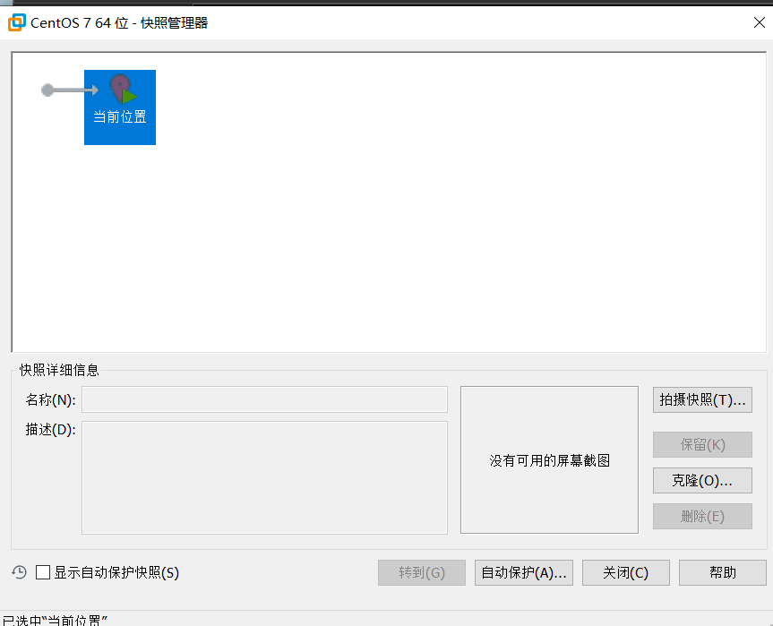

保存快照之后：

选择更改当前的一些设置：比如删除一些指定的文件夹等

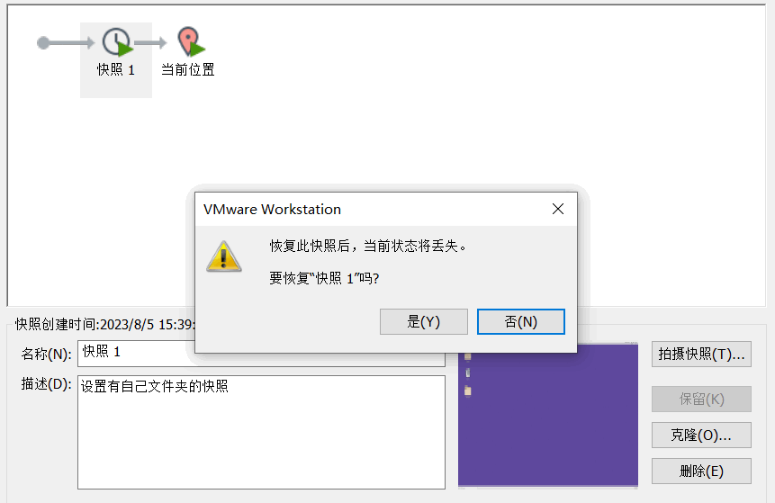

回退之后原虚拟机的设置恢复。

# Linux基础命令


## Linux的目录结构


- `/`，根目录是最顶级的目录了
- Linux只有一个顶级目录：`/`
- 路径描述的层次关系同样适用`/`来表示
- /home/itheima/a.txt，表示根目录下的home文件夹内有itheima文件夹，内有a.txt


## ls命令

功能：列出文件夹信息

语法：`ls [-l -h -a] [参数]`

- 参数：被查看的文件夹，不提供参数，表示查看当前工作目录
- -l，以列表形式查看
- -h，配合-l，以更加人性化的方式显示文件大小
- -a，显示隐藏文件


以列表的形式查看：

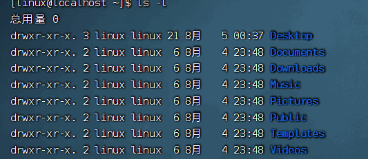

```linux
ls -a -l
显示文件夹的信息，
```

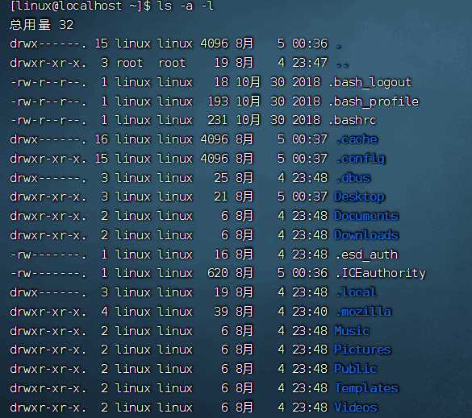

### 隐藏文件、文件夹

在Linux中以`.`开头的，均是隐藏的。

默认不显示出来，需要`-a`选项才可查看到。


## pwd命令

功能：展示当前工作目录

语法：`pwd`

```linux
pwd
```


## cd命令

功能：切换工作目录

语法：`cd [目标目录]`

参数：目标目录，要切换去的地方，不提供默认切换到`当前登录用户HOME目录`


## HOME目录

每一个用户在Linux系统中都有自己的专属工作目录，称之为HOME目录。

- 普通用户的HOME目录，默认在：`/home/用户名`

- root用户的HOME目录，在：`/root`

FinalShell登陆终端后，默认的工作目录就是用户的HOME目录


## 相对路径、绝对路径

- 相对路径，==非==`/`开头的称之为相对路径

  相对路径表示以`当前目录`作为起点，去描述路径，如`test/a.txt`，表示当前工作目录内的test文件夹内的a.txt文件

- 绝对路径，==以==`/`开头的称之为绝对路径

  绝对路径从`根`开始描述路径


## 特殊路径符

- `.`，表示当前，比如./a.txt，表示当前文件夹内的`a.txt`文件

- `..`，表示上级目录，比如`../`表示上级目录，`../../`表示上级的上级目录

- `~`，表示用户的HOME目录，比如`cd ~`，即可切回用户HOME目录

  当前切换：

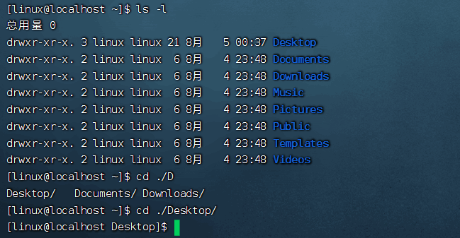

上级切换：

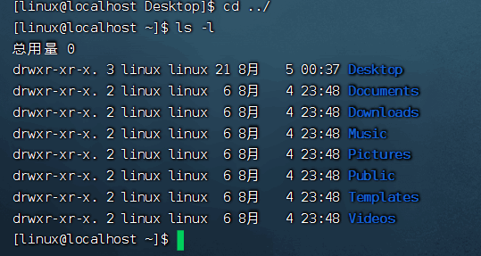

切换到用户目录：

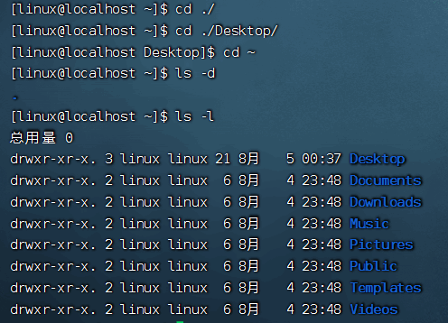

## mkdir命令

功能：创建文件夹

语法：`mkdir [-p] 参数`

- 参数：被创建文件夹的路径
- 选项：-p，可选，表示创建前置路径

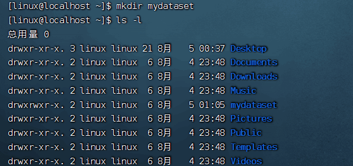

**创建新的文件夹**

## touch命令

功能：创建文件

语法：`touch 参数`

- 参数：被创建的文件路径

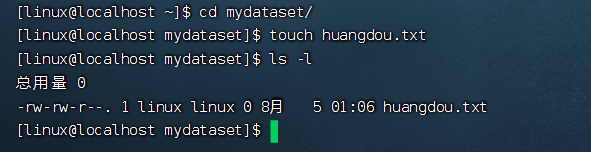

## cat命令

功能：查看文件内容

语法：`cat 参数`

- 参数：被查看的文件路径


## more命令

功能：查看文件，可以支持翻页查看

语法：`more 参数`

- 参数：被查看的文件路径
- 在查看过程中：
  - `空格`键翻页
  - `q`退出查看


## cp命令

功能：复制文件、文件夹

语法：`cp [-r] 参数1 参数2`

- 参数1，被复制的
- 参数2，要复制去的地方
- 选项：-r，可选，复制文件夹使用

示例：

- cp a.txt b.txt，复制当前目录下a.txt为b.txt

- 

  

- cp a.txt test/，复制当前目录a.txt到test文件夹内

  

  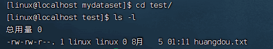

- cp -r test test2，复制文件夹test到当前文件夹内为test2存在

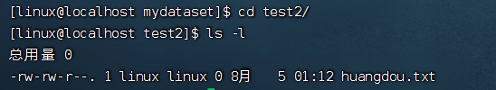

## mv命令

功能：移动文件、文件夹

语法：`mv 参数1 参数2`

- 参数1：被移动的
- 参数2：要移动去的地方，参数2如果不存在，则会进行改名

命令：

```linux
mv b.txt test/
```

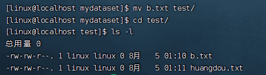

## rm命令

功能：删除文件、文件夹

语法：`rm [-r -f] 参数...参数`

- 参数：支持多个，每一个表示被删除的，空格进行分隔
- 选项：-r，删除文件夹使用
- 选项：-f，强制删除，不会给出确认提示，一般root用户会用到

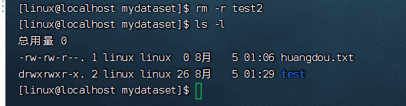

> rm命令很危险，一定要注意，特别是切换到root用户的时候。

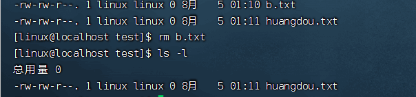

## which命令

功能：查看命令的程序本体文件路径，本质我们使用的都是程序


语法：`which 参数`

- 参数：被查看的命令

- 查看指定文件的地址

  

  查找我们的命令：

  

  

​         查找文件夹：


## find命令

功能：搜索文件

语法1按文件名搜索：`find 路径 -name 参数`

- 路径，搜索的起始路径
- 参数，搜索的关键字，支持通配符*， 比如：`*`test表示搜索任意以test结尾的文件


#### 根据名字查找：


根据后缀前缀等查找

```linux
采用通配符的进行搜索匹配

test*  表示以test 开头的
*test  表示以test结尾的
*test* 表示任何包含test的
```

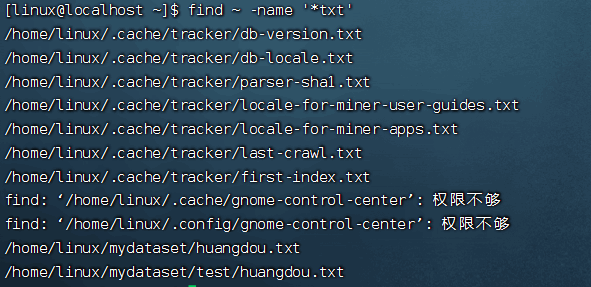


#### 根据文件的大小去搜索：

```linux
find 起始路径   -size +|- -n[kMG]
```

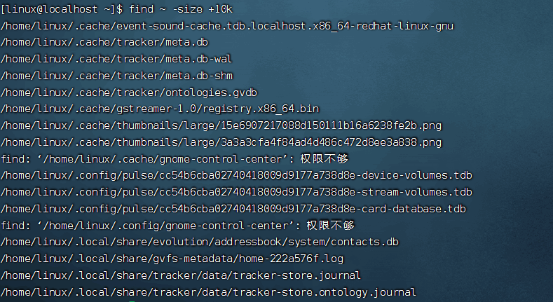

小于10k的

```linux
 find ~ -size -10k
 find ~ -size +10M
  find ~ -size -10G
```


## grep命令

功能：过滤关键字

语法：`grep [-n] 关键字 文件路径`

- 选项-n，可选，表示在结果中显示匹配的行的行号。
- 参数，关键字，必填，表示过滤的关键字，带有空格或其它特殊符号，建议使用””将关键字包围起来
- 参数，文件路径，必填，表示要过滤内容的文件路径，可作为内容输入端口

创建一个文件

```linux
touch test.txt
```

打开这个txt 的文件


> 参数文件路径，可以作为管道符的输入
>
> 

过滤关键字

```linux
 grep -n itheima test.txt
```


```linx
 grep  itheima test.txt
```


## wc命令

功能：统计

语法：`wc [-c -m -l -w] 文件路径`

- gre选项，-c，统计bytes数量
- 选项，-m，统计字符数量
- 选项，-l，统计行数
- 选项，-w，统计单词数量
- 参数，文件路径，被统计的文件，可作为内容输入端口


> 参数文件路径，可作为管道符的输入


## 管道符|

写法：`|`

功能：将符号左边的结果，作为符号右边的输入

示例：

`cat a.txt | grep itheima`，将cat a.txt的结果，作为grep命令的输入，用来过滤`itheima`关键字

可以支持嵌套：

`cat a.txt | grep itheima | grep itcast`


## echo命令

功能：输出内容

语法：`echo 参数`

- 参数：被输出的内容


## `反引号

功能：被两个反引号包围的内容，会作为命令执行

示例：

- echo \`pwd\`，会输出当前工作目录

将pwd的内容作为当前的内容输出到我们的命令行

```
pwd
```


```linux
echo `pwd`
```


## tail命令

功能：查看文件尾部内容

语法：`tail [-f] 参数`

- 参数：被查看的文件
- 选项：-f，持续跟踪文件修改

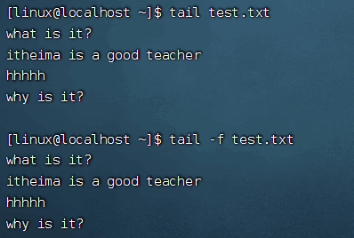

终结任务

```
CTRL+c 强制停止的操作
```


## head命令

功能：查看文件头部内容

语法：`head [-n] 参数`

- 参数：被查看的文件
- 选项：-n，查看的行数

q

## 重定向符

功能：将符号左边的结果，输出到右边指定的文件中去

- `>`，表示覆盖输出
- `>>`，表示追加输出

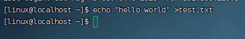

覆盖输出：

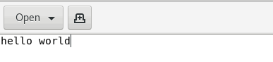

追加输出：

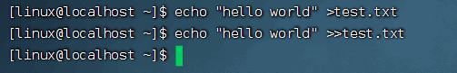

输出的结果：


## vi编辑器/VIM

LInux中经典的文本编辑器


### 命令模式快捷键


### 底线命令快捷键


## 命令的选项

我们学习的一系列Linux命令，它们所拥有的选项都是非常多的。

比如，简单的ls命令就有：-a -A -b -c -C -d -D -f -F -g -G -h -H -i -I -k -l -L -m -n -N -o -p -q -Q -r-R -s -S -t -T -u -U -v -w -x -X -1等选项，可以发现选项是极其多的。

课程中， 并不会将全部的选项都进行讲解，否则，一个ls命令就可能讲解2小时之久。

课程中，会对常见的选项进行讲解， 足够满足绝大多数的学习、工作场景。


### 查看命令的帮助

可以通过：`命令 --help`查看命令的帮助手册


### 查看命令的详细手册

可以通过：`man 命令`查看某命令的详细手册


# Linux常用操作

#### 终止：

```
crtl+c 终止

```

推出或者登出：

```
ctrl+d  推出账号的登录
```

命令的历史

```
history

```

历史命令搜索

```
！命令前缀
```

```
 crtl+r 搜索匹配历史的命令
```

## 软件安装

- CentOS系统使用：
  - yum [install remove search] [-y] 软件名称
    - install 安装
    - remove 卸载
    
    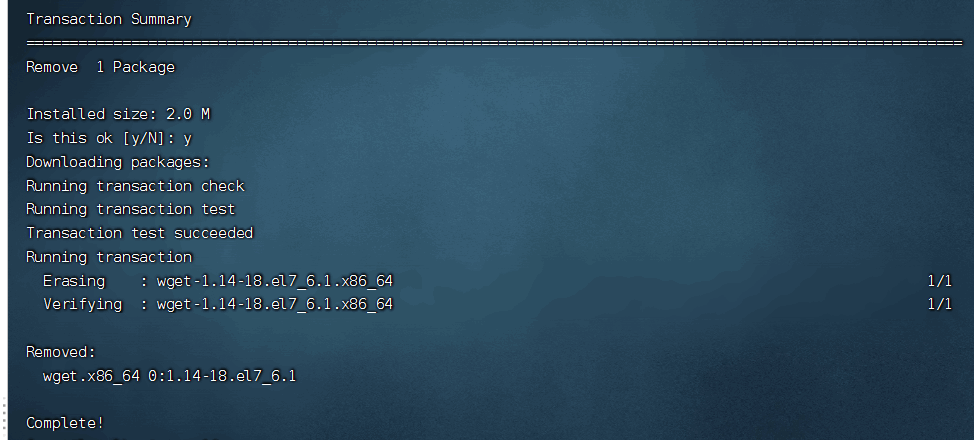
    
    - search 搜索
    
    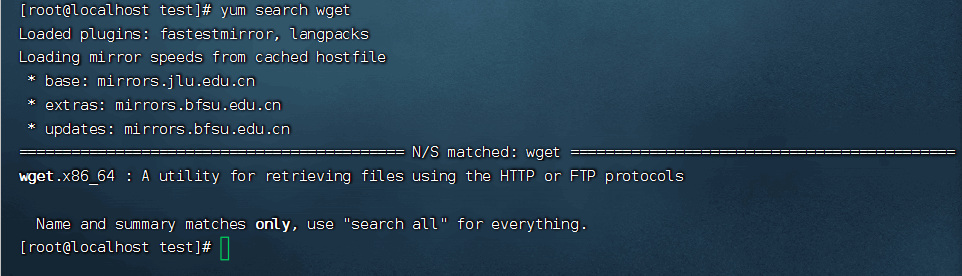
    
    - -y，自动确认

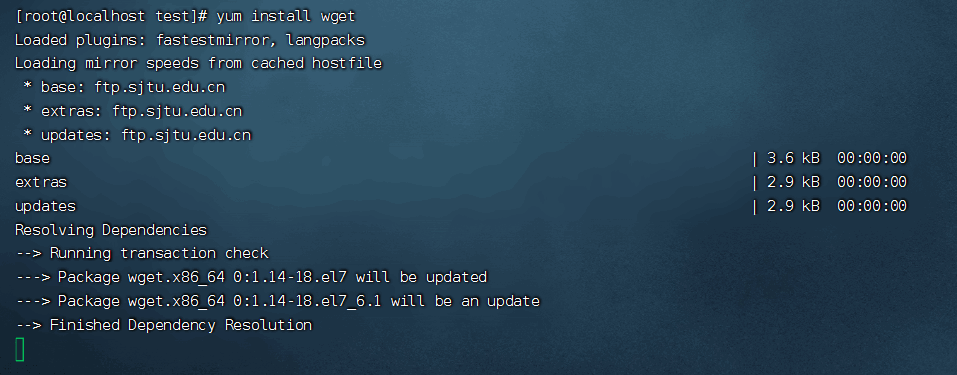

下载完成：


- Ubuntu系统使用
  - apt [install remove search] [-y] 软件名称
    - install 安装
    - remove 卸载
    - search 搜索
    - -y，自动确认

> yum 和 apt 均需要root权限

## systemctl

功能：控制系统服务的启动关闭等也可以控制一些第三方的服务

语法：`systemctl start | stop | restart | disable | enable | status 服务名`

- start，启动
- stop，停止
- status，查看状态
- disable，关闭开机自启
- enable，开启开机自启
- restart，重启

test

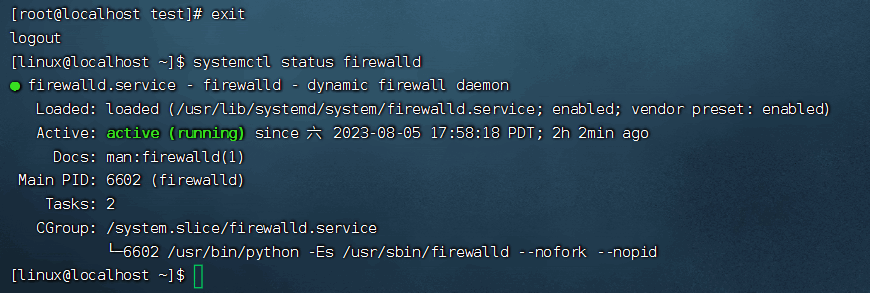

验证：

```
yum install ntp
```

查看外部的服务的状态

```
systemctl status ntpd
```

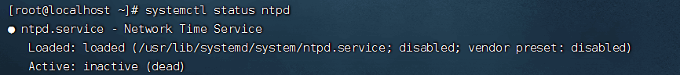

   启动服务：

```
systemctl start ntpd
```

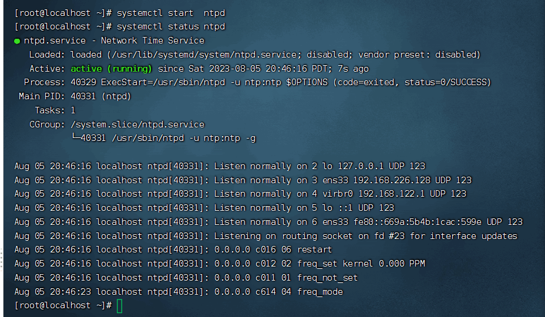

关闭服务：

```
systemctl stop ntpd
```


## 软链接

功能：创建文件、文件夹软链接（**快捷方式**）

语法：`ln -s 参数1 参数2`

- 参数1：被链接的
- 参数2：要链接去的地方（快捷方式的名称和存放位置）

```linux
ln -s 被链接的文件  要链接去的文件夹
```

```
 ln -s /etc/yum.conf ~/yum.conf
```


执行结束：

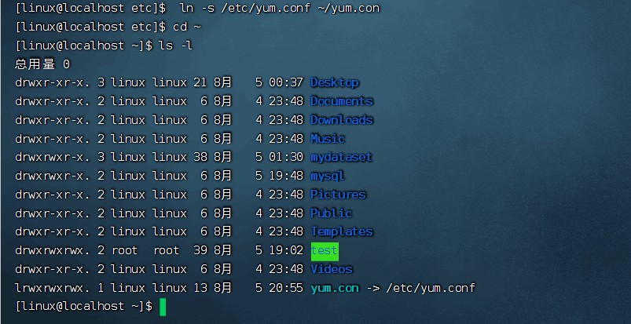

已经创建对应的软连接到我们的指定的文件夹下面

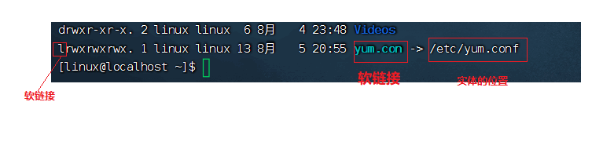

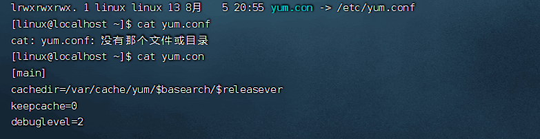

## 日期

语法：`date [-d] [+格式化字符串]`

- -d 按照给定的字符串显示日期，一般用于日期计算

- 格式化字符串：通过特定的字符串标记，来控制显示的日期格式
  - %Y   年%y   年份后两位数字 (00..99)
  - %m   月份 (01..12)
  - %d   日 (01..31)
  - %H   小时 (00..23)
  - %M   分钟 (00..59)
  - %S   秒 (00..60)
  - %s   自 1970-01-01 00:00:00 UTC 到现在的秒数


示例：

date 显示日期：


- 按照2022-01-01的格式显示日期

  

- 按照2022-01-01 10:00:00的格式显示日期

  

- -d选项日期计算

  

  - 支持的时间标记为：

    


## 时区

修改时区为中国时区


## ntp

功能：同步时间

安装：`yum install -y ntp`

启动管理：`systemctl start | stop | restart | status | disable | enable ntpd`


手动校准时间：`ntpdate -u ntp.aliyun.com`


## ip地址

格式：a.b.c.d

- abcd为0~255的数字

```
192.168.88.10
```

设置的IPV4的地址

特殊IP：

- 127.0.0.1，表示本机

  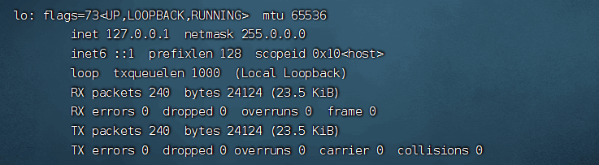

- 0.0.0.0
  - 可以表示本机
  - 也可以表示任意IP（看使用场景）

查看ip：`ifconfig`


## 主机名

功能：Linux系统的名称

查看：`hostname`


设置：`hostnamectl set-hostname 主机名`

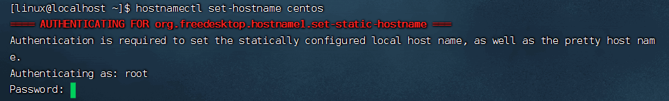

### 域名解析

先查看本机的记录（私人地址本）

```linux
Windows看：C:\Windows\System32\drivers\etc\hosts

Linux看：/etc/hosts

再联网去DNS服务器（如114.114.114.114，8.8.8.8等）询问
```

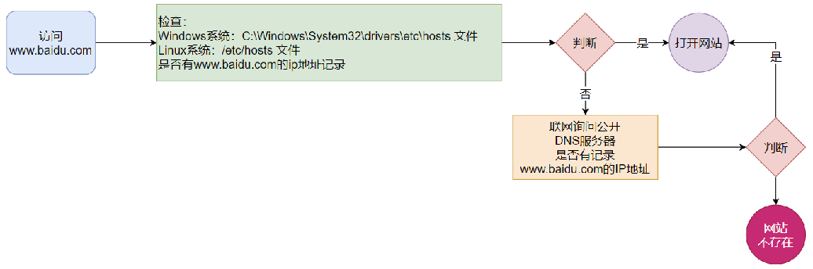


打开指定的目录下的hosts文件：

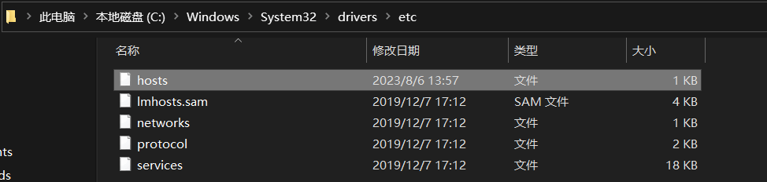

记事本打开hosts的文件：

并编辑 

```linux
 192.168.226.128  centos建立映射关系
```

之后重新设置整个时候：

将原本的IP的地址设置成一个名字，使其完成本地的解析

读取出指定的数据

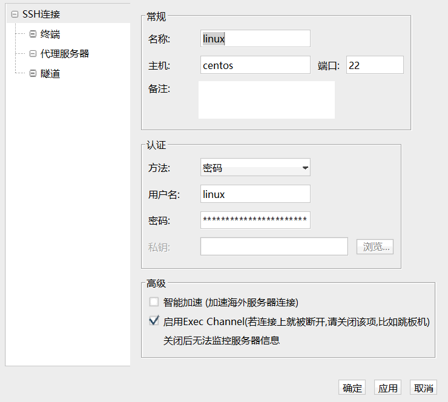

设置后：

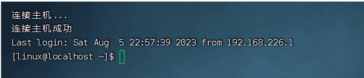

## 配置VMware固定IP

1. 修改VMware网络，参阅PPT，图太多

2. 设置Linux内部固定IP

   修改文件：`/etc/sysconfig/network-scripts/ifcfg-ens33`

   示例文件内容：

   ```shell
   TYPE="Ethernet"
   PROXY_METHOD="none"
   BROWSER_ONLY="no"
   BOOTPROTO="static"			# 改为static，固定IP
   DEFROUTE="yes"
   IPV4_FAILURE_FATAL="no"
   IPV6INIT="yes"
   IPV6_AUTOCONF="yes"
   IPV6_DEFROUTE="yes"
   IPV6_FAILURE_FATAL="no"
   IPV6_ADDR_GEN_MODE="stable-privacy"
   NAME="ens33"
   UUID="1b0011cb-0d2e-4eaa-8a11-af7d50ebc876"
   DEVICE="ens33"
   ONBOOT="yes"
   IPADDR="192.168.88.131"		# IP地址，自己设置，要匹配网络范围
   NETMASK="255.255.255.0"		# 子网掩码，固定写法255.255.255.0
   GATEWAY="192.168.88.2"		# 网关，要和VMware中配置的一致
   DNS1="192.168.88.2"			# DNS1服务器，和网关一致即可
   ```

## ps命令

功能：查看进程信息

语法：`ps -ef`，查看全部进程信息，可以搭配grep做过滤：`ps -ef | grep xxx`

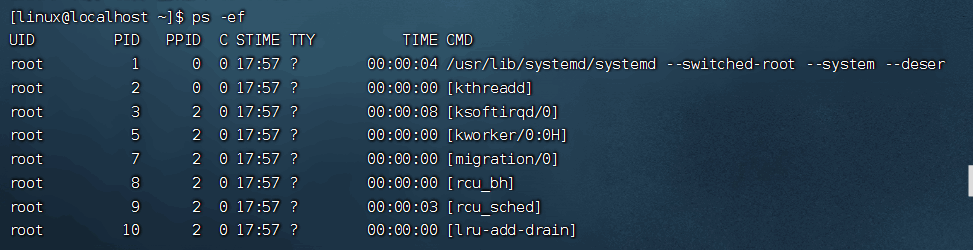

从左到右分别是：

UID：进程所属的用户ID

PID：进程的进程号ID

PPID：进程的父ID（启动此进程的其它进程）

C：此进程的CPU占用率（百分比）

STIME：进程的启动时间

TTY：启动此进程的终端序号，如显示?，表示非终端启动TIME：进程占用CPU的时间

CMD：进程对应的名称或启动路径或启动命令

管道符和二次的过滤的命令：

```
ps -ef | grep tail，即可准确的找到tail命令的信息

```

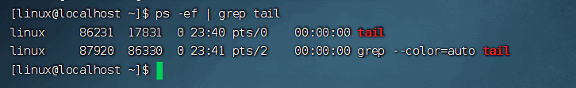

## kill命令


## 端口：

端口，是设备与外界通讯交流的出入口。

端口可以分为：物理端口和虚拟端口两类

物理端口：又可称之为接口，是可见的端口，如USB接口，RJ45网口，HDMI端口等

虚拟端口：是指计算机内部的端口，是不可见的，是用来操作系统和外部进行交互使用的


计算机程序之间的通讯，通过IP只能锁定计算机，但是无法锁定具体的程序。

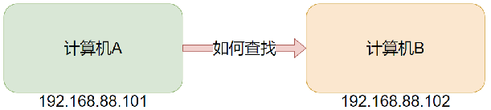

通过端口可以锁定计算机上具体的程序，确保程序之间进行沟通。


Linux系统是一个超大号小区，可以支持65535个端口，这6万多个端口分为3类进行使用：

```
公认端口：1~1023，通常用于一些系统内置或知名程序的预留使用，如SSH服务的22端口，HTTPS服务的443端口非特殊需要，不要占用这个范围的端口

注册端口：1024~49151，通常可以随意使用，用于松散的绑定一些程序\服务

动态端口：49152~65535，通常不会固定绑定程序，而是当程序对外进行网络链接时，用于临时使用。
```

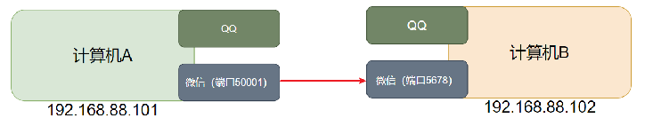

如图中，计算机A的微信连接计算机B的微信，A使用的50001即动态端口，临时找一个端口作为出口计算机B的微信使用端口5678，即注册端口，长期绑定此端口等待别人连接

## nmap命令


查看端口的占用：

```
nmap 192.168.226.128
```

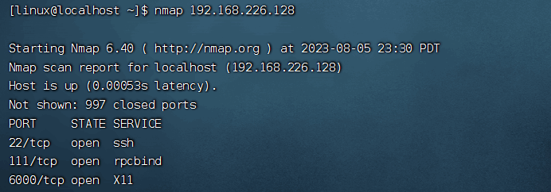

## netstat命令

功能：查看端口占用

用法：`netstat -anp | grep xxx`

```
netstat -anp | grep 6000
```

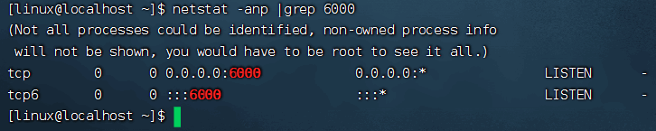


## ping命令

测试网络是否联通

语法：`ping [-c num] 参数`


```
 ping baidu.com
```

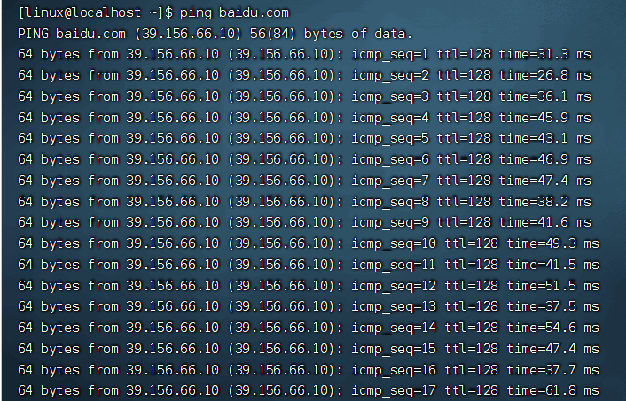

## wget命令


## curl命令


示例：

```linux
curl url
```

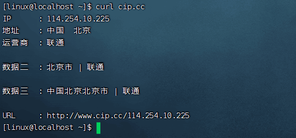


## top命令

功能：查看主机运行状态

语法：`top`，查看基础信息

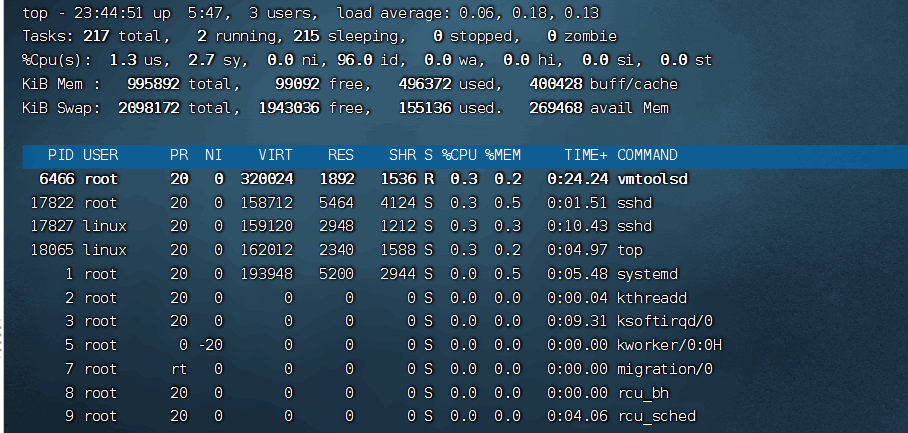

可用选项：


交互式模式中，可用快捷键：


命令详解：

```
top - 23:45:00 up  5:47,  3 users,  load average   1，5，15 : 0.05, 0.17, 0.12
top 系统名称
23:45:00 系统时间
up  5:47  启动了五分四十七秒
3 users   三个用户登录
load average   1，5，15 分钟的负载

Tasks: 217 total,   3 running, 214 sleeping,   0 stopped,   0 zombie

Tasks: 217 total   217 个进程
3 running   三个执行
214 sleeping 二百一十四个休眠
0 stopped   零个停止
0 zombie    零个僵尸进程

%Cpu(s):  1.3 us,  3.0 sy,  0.0 ni, 95.7 id,  0.0 wa,  0.0 hi,  0.0 si,  0.0 st

%Cpu(s)：CPU使用率，
us：用户CPU使用率，
sy：系统CPU使用率，
ni：高优先级进程占用
CPU时间百分比，
id：空闲CPU率，
wa：IO等待
CPU占用率，
hi：CPU硬件中断率，
si：CPU软件中断率，
st：强制等待占用CPU率

KiB Mem :   995892 total,    99344 free,   496176 used,   400372 buff/cache
物理内存，
total：总量，
free：空闲，
used：使用，
buff/cache：buff和cache占用

KiB Swap:  2098172 total,  1943036 free,   155136 used.   269736 avail Mem 
虚拟内存（交换空间），
total：总量，
free：空闲，
used：使用，
buff/cache：buff和cache占用


```

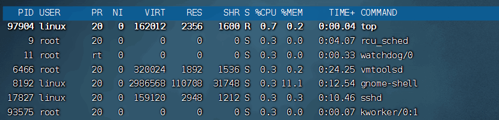

```
PID：进程id
USER：进程所属用户
PR：进程优先级，越小越高
NI：负值表示高优先级，正表示低优先级
VIRT：进程使用虚拟内存，单位KB
RES：进程使用物理内存，单位KB
SHR：进程使用共享内存，单位KB
S：进程状态（S休眠，R运行，Z僵死状态，N负数优先级，I空闲状态）
%CPU：进程占用CPU率
%MEM：进程占用内存率
TIME+：进程使用CPU时间总计，单位10毫秒
COMMAND：进程的命令或名称或程序文件路径
```


## df命令

查看磁盘占用

```
df -h
```


## iostat命令

查看CPU、磁盘的相关信息

```
可以使用iostat查看CPU、磁盘的相关信息
语法：iostat [-x] [num1] [num2]
选项：-x，显示更多信息
num1：数字，刷新间隔，num2：数字，刷新几次

```

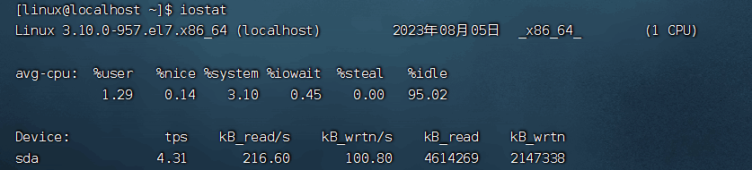


## sar命令

查看网络统计


## 环境变量

环境变量是操作系统（Windows、Linux、Mac）在运行的时候，记录的一些关键性信息，用以辅助系统运行。在Linux系统中执行：env命令即可查看当前系统中记录的环境变量

环境变量是一种KeyValue型结构，即名称和值，如下图：

- 临时设置：export 变量名=变量值
- 永久设置：
  - 针对用户，设置用户HOME目录内：`.bashrc`文件
  - 针对全局，设置`/etc/profile`


### PATH变量

记录了执行程序的搜索路径

可以将自定义路径加入PATH内，实现自定义命令在任意地方均可执行的效果


## $符号

可以取出指定的环境变量的值

语法：`$变量名`

示例：

`echo $PATH`，输出PATH环境变量的值

`echo ${PATH}ABC`，输出PATH环境变量的值以及ABC

如果变量名和其它内容混淆在一起，可以使用${}


## 压缩解压

### 压缩

`tar -zcvf 压缩包 被压缩1...被压缩2...被压缩N`

- -z表示使用gzip，可以不写


`zip [-r] 参数1 参数2 参数N`


### 解压

`tar -zxvf 被解压的文件 -C 要解压去的地方`

- -z表示使用gzip，可以省略
- -C，可以省略，指定要解压去的地方，不写解压到当前目录


`unzip [-d] 参数`


## 用户及其用户组：

### 认知权限信息：

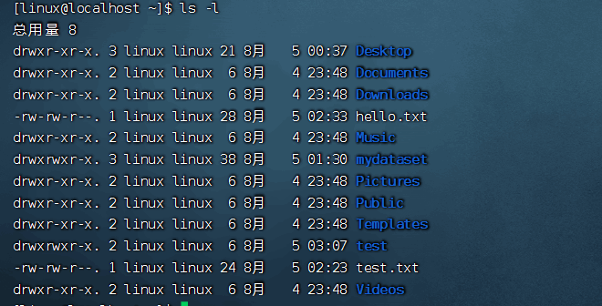

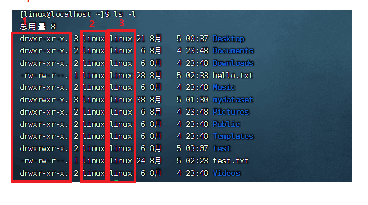

1：表示文件，文件夹的控制信息

```
drwxr-xr-x. 3 linux linux 21 8月   5 00:37 Desktop
drwxr-xr-x. 2 linux linux  6 8月   4 23:48 Documents
drwxr-xr-x. 2 linux linux  6 8月   4 23:48 Downloads
-rw-rw-r--. 1 linux linux 28 8月   5 02:33 hello.txt
drwxr-xr-x. 2 linux linux  6 8月   4 23:48 Music
drwxrwxr-x. 3 linux linux 38 8月   5 01:30 mydataset
```

```
drwxr-xr-x.
第一位 -或者l或者d:其中d表示文件夹，l表示软连接
解析出来就是：
文件夹，所属用户权限有rwx，所属用户组的权限有r无w有x,其他用户的权限有r无w有x;
```

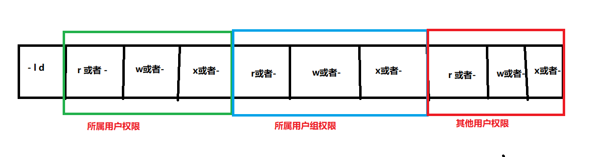

2：表示文件，文件夹的所属用户

3：表示文件，文件夹的所属用户组

### Linux 的权限：

```
可读：r
针对文件：查看文件的内容
针对文件夹：可以查看文件夹的内容 例如ls的命令；
可写: w
针对文件：可以修改文件
针对文件夹：可以在文件夹内：创建 ，删除，改名
可执行：x
针对文件：针对文件表示可以作为程序执行
针对文件夹：表示可以更改工作目录到此文件夹中，即cd 进入
```


Linux用户对根目录有读 可执行但是不可写的

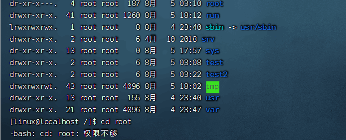

### su命令

切换用户

语法：`su [-] [用户]`


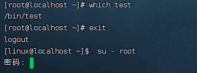

回退到之前的：

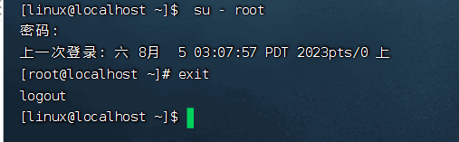

### sudo命令

获取临时的root 的获取


比如：

```shell
linux ALL=(ALL)       NOPASSWD: ALL
```

在visudo内配置如上内容，可以让itheima用户，无需密码直接使用`sudo`

实验：

在根目录下面的普通用户的权限不足，无法创建


通过为我们的Linux配置获取临时的权限

先执行,切换到root的权限

```
su -  root
```

执行

```
visudo
```

执行后，在文件的最后编辑

```mysql
linux ALL=(ALL)       NOPASSWD: ALL
```

执行

```
sudo mkdir test2/
```

创建成功。

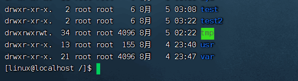

## 修改权限信息


### chmod命令

修改文件、文件夹权限

语法：`chmod [-R] 权限 参数`

- 权限，要设置的权限，比如755，表示：`rwxr-xr-x`

  

- 参数，被修改的文件、文件夹

- 选项-R，设置文件夹和其内部全部内容一样生效

  设置-R的时候，这个是可以将整个文件夹及其内部的所有设置为该权限

  

示例：

```linux
chmod u=rwx,g=rx,o=x hello.txt  修改文件的权限

chmod u=rwx,g=rx,o=x test   修改文件夹的权限
```

```
chmod 777 test.txt
有全部的权限
```


结果:


```
chmod 777 test 
让文件夹有全部的权限
```

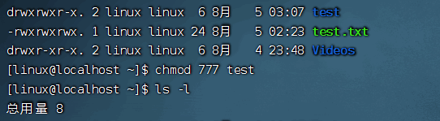

结果：


### chown命令

修改文件、文件夹所属用户、组

语法：`chown [-R] [用户][:][用户组] 文件或文件夹`


测试：

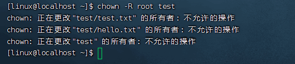


结论：普通的用户没办法使用整个命令

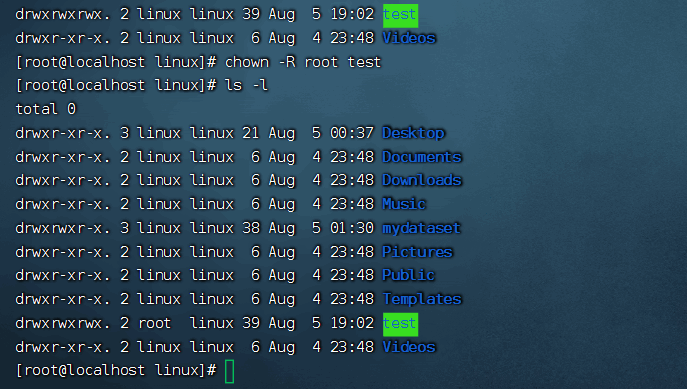

将用户及其用户组名改成root

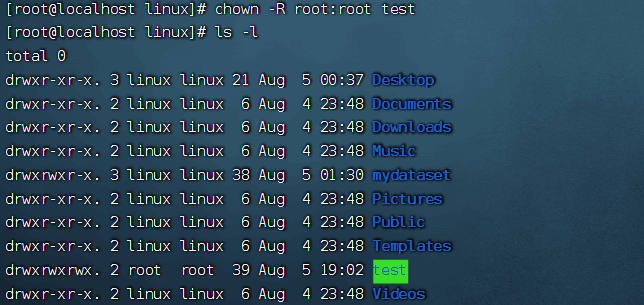

内部的所有文件也被修改为root 和root

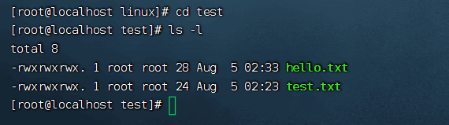

## 用户组管理


创建用户组：

```
groupadd
```

```

-f, --force 如果组已经存在则成功退出
并且如果 GID 已经存在则取消 -g
-g, --gid GID 为新组使用 GID
-h, --help 显示此帮助信息并推出
-K, --key KEY=VALUE 不使用 /etc/login.defs 中的默认值
-o, --non-unique 允许创建有重复 GID 的组
-p, --password PASSWORD 为新组使用此加密过的密码
-r, --system 创建一个系统账户
-R, --root CHROOT_DIR chroot 到的目录

```

删除用户组：

```
groupdel
```


## 用户管理


创建用户：

```
 groupadd test
 groupadd test1 -g test 
```


删除用户的home的目录：

```
userdel -r test1
```

查看用户：

```mysql
useradd test3 -g test
```

```
su -  test3
```

```
id
```

结果：

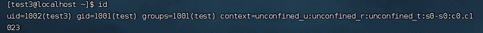

将用户切换到指定的额用户组

```
usermod -aG test test4
```

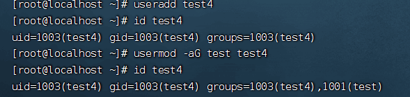

## genent命令

- `getent group`，查看系统全部的用户组

  

  ```
  test:x:1001:test4
  test4:x:1003:
  myuser:x:1004:
  用户组的名字：密码：用户组的ID
  ```

  

- `getent passwd`，查看系统全部的用户

  

共有七份的用户的信息：

```linux
test2:x:1001:1001::/home:/bin/bash
test3:x:1002:1001::/home/test3:/bin/bash
test4:x:1003:1003::/home/test4:/bin/bash
myuser:x:1004:1004::/home/myuser:/bin/bash
用户名：密码：用户ID：组ID：：描述信息：home目录：执行终端
```


## env命令

查看系统全部的环境变量

语法：`env`

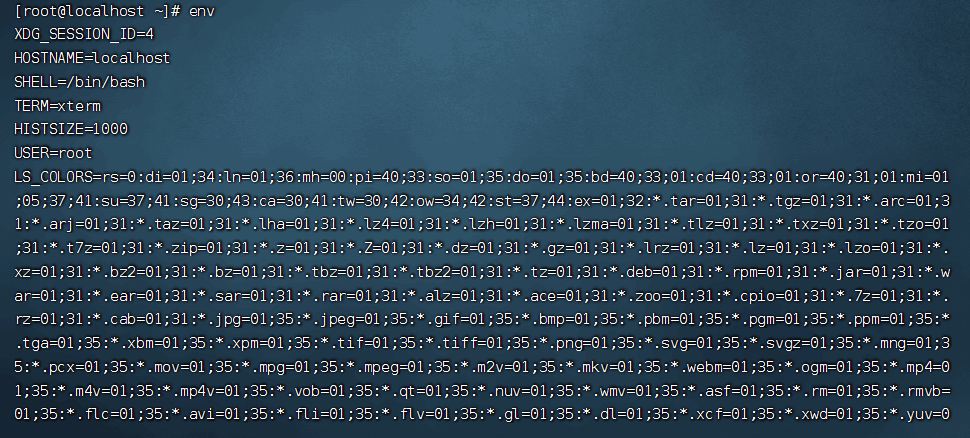


