# MYSQL

## SQL 的通用语法：

```mysql
1). SQL语句可以单行或多行书写，以分号结尾。

2). SQL语句可以使用空格/缩进来增强语句的可读性。

3). MySQL数据库的SQL语句不区分大小写，关键字建议使用大写。

4). 注释：

单行注释：-- 注释内容 或 # 注释内容

多行注释：/* 注释内容 */
```

## SQL语句的分类

| 分类 | 全称                               | 说明                                                   |
| ---- | ---------------------------------- | ------------------------------------------------------ |
| DDL  | **Data Definition** **Language**   | 数据定义语言，用来定义数据库对象(数据库，表，字段)     |
| DML  | **Data Manipulation** **Language** | 数据操作语言，用来对数据库表中的数据进行增删改         |
| DQL  | **Data Query Language**            | 数据查询语言，用来查询数据库中表的记录                 |
| DCL  | **Data Control Language**          | 数据控制语言，用来创建数据库用户、控制数据库的访问权限 |

### **DDL**

#### 数据库的操作：

##### 查询

```mysql
show databases; 
```

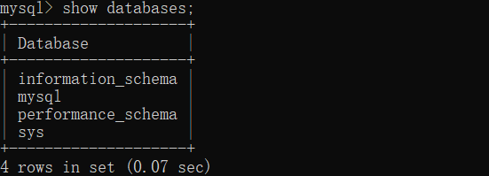

###### 查询当前数据库

```mysql
select database();
```

##### 

##### 创建

```mysql
create database [ if not exists ] 数据库名 [ default charset 字符集 ] [ collate 排序
规则 ] ;
```

```mysql
--创建数据库
create database mydataset;
```

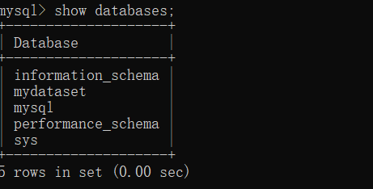

```mysql
mysql> create database if not exists mydataset;
Query OK, 1 row affected, 1 warning (0.02 sec)
```

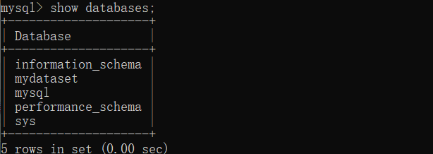

##### 删除

```mysql
drop database [if exists] 数据库名
```


删除后检查存在的数据库：


已经成功删除对应的数据库；

##### 使用

```mysql
use 数据库名 ;
```

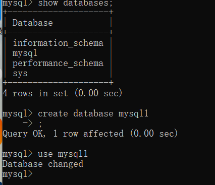

当执行了许多的mysql 的操作之后如何知道当前在哪个对应的数据库下面呢

```mysql
select database();
```

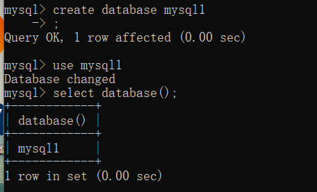

#### 表的操作

##### **查询当前数据库所有表**

```mysql
show tables;
```

具体的操作，需要先切换到指定的数据库下面，然后再执行show table的操作

```mysql
use sys;
show tables;
```

##### 查询表的结构：

```mysql
desc 表名 ;
```

查询结果：

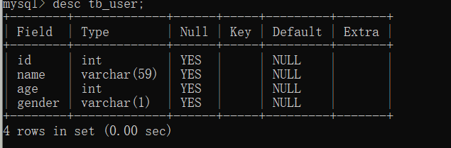

```
FIELD 行的名字
类型
是否为空
是否为键
```

```
CREATE TABLE tb_user1(
id int comment '编号' primary key ,
name varchar(59)  comment '姓名',
age int  comment '编号',
gender varchar(1) comment '性别'
)comment '用户表';
```


这个将id 设置为主键


##### 查询指定表的建表语句

```mysql
show create table 表名 ;
```

通过这条指令，主要是用来查看建表语句的，而有部分参数我们在创建表的时候，并未指定也会查询

到，因为这部分是数据库的默认值，如：存储引擎、字符集等。

查询结果：

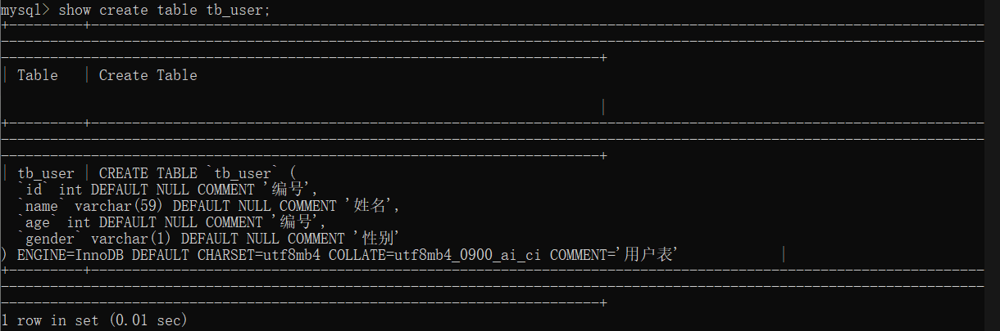

```
CREATE TABLE `tb_user` (
  `id` int DEFAULT NULL COMMENT '编号',
  `name` varchar(59) DEFAULT NULL COMMENT '姓名',
  `age` int DEFAULT NULL COMMENT '编号',
  `gender` varchar(1) DEFAULT NULL COMMENT '性别'
) ENGINE=InnoDB DEFAULT CHARSET=utf8mb4 COLLATE=utf8mb4_0900_ai_ci COMMENT='用户表'

存储引擎为InnoDB
```


##### **创建表结构**

```mysql
CREATE TABLE 表名(
字段1 字段1类型 [ COMMENT 字段1注释 ],
字段2 字段2类型 [COMMENT 字段2注释 ],
字段3 字段3类型 [COMMENT 字段3注释 ],
......
字段n 字段n类型 [COMMENT 字段n注释 ]
) [ COMMENT 表注释 ] ;
```

举例：

创建表结构的时候：具体的表的信息如下图所示：


那么创建整个表的时候的SQL的语句：

```mysql
CREATE TABLE tb_user(
id int comment '编号',
name varchar(59)  comment '姓名',
age int  comment '编号',
gender varchar(1) comment '性别'
)comment '用户表';
```

创建的结果：


##### 表的操作-数据类型：

```mysql
数字类型
---------------------------------------------------------------------
整数类型: tinyint , smallint , int/integer
浮点类型: float , double
decimal


字符串类型(必须设置字符串的允许的最大长度)
---------------------------------------------------------------------
char : 定长字符串
varchar: 可变长度字符串
text/longtext : 适合存储大字符串，在使用的时候不需要指定长度


日期类型
---------------------------------------------------------------------
date : 日期，用来存储年月日
datetime : 用来存储年月日，时分秒，微妙
time : 时间 ， 用来存储时分秒
year : 年份数值


布尔类型
---------------------------------------------------------------------
boolean : 使用 1 和 0 代表 true/false


Blob类型(流的存储)
---------------------------------------------------------------------
blob
longblob


```

```mysql
char 与 varchar 都可以描述字符串，char是定长字符串，指定长度多长，就占用多少个字符，和
字段值的长度无关 。而varchar是变长字符串，指定的长度为最大占用长度 。相对来说，char的性
能会更高些。
```

例如：

```mysql
如：
1). 用户名 username ------> 长度不定, 最长不会超过50
username varchar(50)
2). 性别 gender ---------> 存储值, 不是男,就是女
gender char(1)
3). 手机号 phone --------> 固定长度为11
phone char(11)
```

```mysql
如:
1). 生日字段 birthday
birthday date
2). 创建时间 createtime
createtime datetime
```

##### 表具体的操作：

```mysql
设计一张员工信息表，要求如下：
1. 编号（纯数字）
2. 员工工号 (字符串类型，长度不超过10位)
3. 员工姓名（字符串类型，长度不超过10位）
4. 性别（男/女，存储一个汉字）
5. 年龄（正常人年龄，不可能存储负数）
6. 身份证号（二代身份证号均为18位，身份证中有X这样的字符）
7. 入职时间（取值年月日即可）
```

code:


```mysql
create table emp(
id int comment '编号',
workno varchar(10) comment '工号',
name varchar(10) comment '姓名',
gender char(1) comment '性别',
age tinyint unsigned comment '年龄',
idcard char(18) comment '身份证号',
entrytime date comment '入职时间'
) comment '员工表';
```

结果：


查询表结构：


查询创建表的语句：


##### 表的操作：---修改

添加字段：

```mysql
ALTER TABLE 表名 ADD 字段名 类型 (长度) [ COMMENT 注释 ] [ 约束 ];
```


示例：

```
desc emp;

alter table emp add  haveiphone varchar(12) comment '是否有iPhone';
```

```
desc emp；
```


修改数据类型

```mysql
ALTER TABLE 表名 MODIFY 字段名 新数据类型 (长度); 
```


```
alter table emp modify haveiphone varchar(2);
```


修改字段名和字段类型

```mysql
ALTER TABLE 表名 CHANGE 旧字段名 新字段名 类型 (长度) [ COMMENT 注释 ] [ 约束 ];
```


```
alter table emp change haveiphone myiphone varchar(12);
```


删除字段：

```mysql
ALTER TABLE 表名 DROP 字段名;
```


修改表名：

```mysql
ALTER TABLE 表名 RENAME TO 新表名;
```

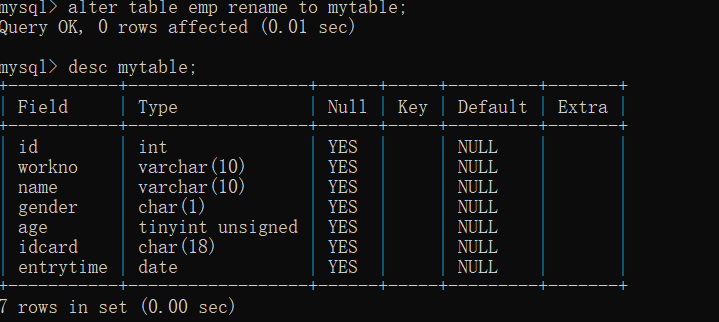

```
alter table emp rename to emper;
```

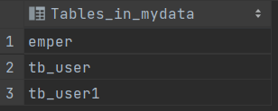

##### 表的删除：

```mysql
DROP TABLE [ IF EXISTS ] 表名；
```

练习：

```
create table mmp(
id int comment '编号',
workno varchar(10) comment '工号',
name varchar(10) comment '姓名',
gender char(1) comment '性别',
age tinyint unsigned comment '年龄',
idcard char(18) comment '身份证号',
entrytime date comment '入职时间'
) comment '员工表';
```

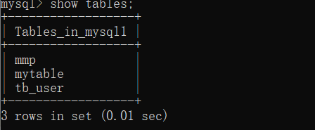

结果：


删除指定的表并创建：

```mysql
TRUNCATE TABLE 表名;
```

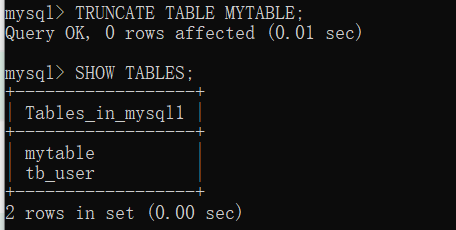


### DML

```mysql
添加数据（INSERT）
修改数据（UPDATE）
删除数据（DELETE）
```

#### 添加数据（指定字段添加）：

```mysql
INSERT INTO 表名 (字段名1, 字段名2, ...) VALUES (值1, 值2, ...);
```

test:

```mysql
insert into mytable(id,workno,name,gender,age,idcard,entrytime)
values(1,'1','Itcast','男',10,'123456789012345678','2000-01-01');
```

#### 查询数据：

```mysql
select * from mytable
```


#### 给全部字段添加数据

```mysql
INSERT INTO 表名 VALUES (值1, 值2, ...);
```

demo:

```mysql
insert into mytable values(2,'1','Itcast','男',10,'123456789012345678','2000-01-01');
insert into mytable values(3,'1','Itcast','男',10,'123456789012345678','2000-01-01');
insert into mytable values(4,'1','Itcast','男',10,'123456789012345678','2000-01-01');
insert into mytable values(5,'1','Itcast','男',10,'123456789012345678','2000-01-01');
```

结果：

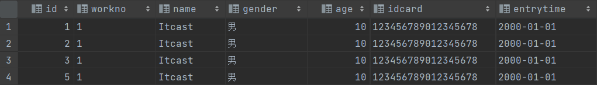

#### 批量添加数据：

```mysql
INSERT INTO 表名 (字段名1, 字段名2, ...) VALUES (值1, 值2, ...), (值1, 值2, ...), (值
1, 值2, ...) ;
```

测试：

```MYSQL
insert into mytable values (6,'1','Itcast','男',10,'123456789012345678','2000-01-01'),(5,'1','Itcast','男',10,'123456789012345678','2000-01-01'),(7,'1','Itcast','男',10,'123456789012345678','2000-01-01'),
(8,'1','Itcast','男',10,'123456789012345678','2000-01-01'),(9,'1','Itcast','男',10,'123456789012345678','2000-01-01'),(10,'1','Itcast','男',10,'123456789012345678','2000-01-01'),(11,'1','Itcast','男',10,'123456789012345678','2000-01-01');
```

结果：


#### 数据的修改：

```mysql
UPDATE 表名 SET 字段名1 = 值1 , 字段名2 = 值2 , .... [ WHERE 条件 ] ;
```

示例：修改的条件如果没有，那么就将会修改整个表的信息


```mysql
update mytable set name='zhangdatu' where id=1;

update mytable set name='zhangdatu';
```

#### 数据的删除：

```mysql
DELETE FROM 表名 [ WHERE 条件 ] ; 
```

```mysql
delete  from mytable where gender='女';
```

#### DQL 数据查询的操作：

准备工作：创建对应的表，然后再进行查询的操作：

```musql
drop table if exists employee;
create table emp(
id int comment '编号',
workno varchar(10) comment '工号',
name varchar(10) comment '姓名',
gender char(1) comment '性别',
age tinyint unsigned comment '年龄',
idcard char(18) comment '身份证号',
workaddress varchar(50) comment '工作地址',
entrydate date comment '入职时间'
)comment '员工表';
INSERT INTO emp (id, workno, name, gender, age, idcard, workaddress, entrydate)
VALUES (1, '00001', '柳岩666', '女', 20, '123456789012345678', '北京', '2000-01-01');
INSERT INTO emp (id, workno, name, gender, age, idcard, workaddress, entrydate)
VALUES (2, '00002', '张无忌', '男', 18, '123456789012345670', '北京', '2005-09-01');
INSERT INTO emp (id, workno, name, gender, age, idcard, workaddress, entrydate)
VALUES (3, '00003', '韦一笑', '男', 38, '123456789712345670', '上海', '2005-08-01');
INSERT INTO emp (id, workno, name, gender, age, idcard, workaddress, entrydate)
VALUES (4, '00004', '赵敏', '女', 18, '123456757123845670', '北京', '2009-12-01');
INSERT INTO emp (id, workno, name, gender, age, idcard, workaddress, entrydate)
VALUES (5, '00005', '小昭', '女', 16, '123456769012345678', '上海', '2007-07-01');
INSERT INTO emp (id, workno, name, gender, age, idcard, workaddress, entrydate)
VALUES (6, '00006', '杨逍', '男', 28, '12345678931234567X', '北京', '2006-01-01');
INSERT INTO emp (id, workno, name, gender, age, idcard, workaddress, entrydate)
VALUES (7, '00007', '范瑶', '男', 40, '123456789212345670', '北京', '2005-05-01');
INSERT INTO emp (id, workno, name, gender, age, idcard, workaddress, entrydate)
VALUES (8, '00008', '黛绮丝', '女', 38, '123456157123645670', '天津', '2015-05-01');
INSERT INTO emp (id, workno, name, gender, age, idcard, workaddress, entrydate)
VALUES (9, '00009', '范凉凉', '女', 45, '123156789012345678', '北京', '2010-04-01');
INSERT INTO emp (id, workno, name, gender, age, idcard, workaddress, entrydate)
VALUES (10, '00010', '陈友谅', '男', 53, '123456789012345670', '上海', '2011-01-01');
INSERT INTO emp (id, workno, name, gender, age, idcard, workaddress, entrydate)
VALUES (11, '00011', '张士诚', '男', 55, '123567897123465670', '江苏', '2015-05-01');
INSERT INTO emp (id, workno, name, gender, age, idcard, workaddress, entrydate)
VALUES (12, '00012', '常遇春', '男', 32, '123446757152345670', '北京', '2004-02-01');
INSERT INTO emp (id, workno, name, gender, age, idcard, workaddress, entrydate)
VALUES (13, '00013', '张三丰', '男', 88, '123656789012345678', '江苏', '2020-11-01');
INSERT INTO emp (id, workno, name, gender, age, idcard, workaddress, entrydate)
VALUES (14, '00014', '灭绝', '女', 65, '123456719012345670', '西安', '2019-05-01');
INSERT INTO emp (id, workno, name, gender, age, idcard, workaddress, entrydate)
VALUES (15, '00015', '胡青牛', '男', 70, '12345674971234567X', '西安', '2018-04-01');
INSERT INTO emp (id, workno, name, gender, age, idcard, workaddress, entrydate)
VALUES (16, '00016', '周芷若', '女', 18, null, '北京', '2012-06-01');

delete from emp ;
```

#### 基本的语法：

```mysql
SELECT
字段列表
FROM
表名列表
WHERE
条件列表
GROUP BY
分组字段列表
HAVING
分组后条件列表
ORDER BY
排序字段列表
LIMIT
分页参数
```

#### 基础的查询：

##### 查询多个字段：

```mysql
SELECT 字段1, 字段2, 字段3 ... FROM 表名 ;
```

```mysql
select id,name,age from emp;
```


##### 查询所有的字段：

```mysql
SELECT * FROM 表名 ;
```

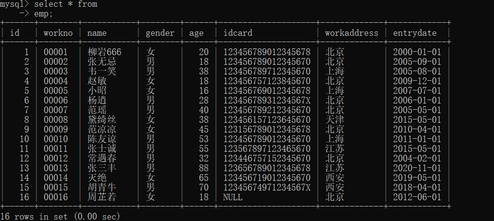

##### 字段设置别名：

```mysql
SELECT 字段1 [ AS 别名1 ] , 字段2 [ AS 别名2 ] ... FROM 表名;
```

##### 去除重复的记录：

```mysql
SELECT DISTINCT 字段列表 FROM 表名; 
```

```mysql
select  distinct id,name from emp;
```

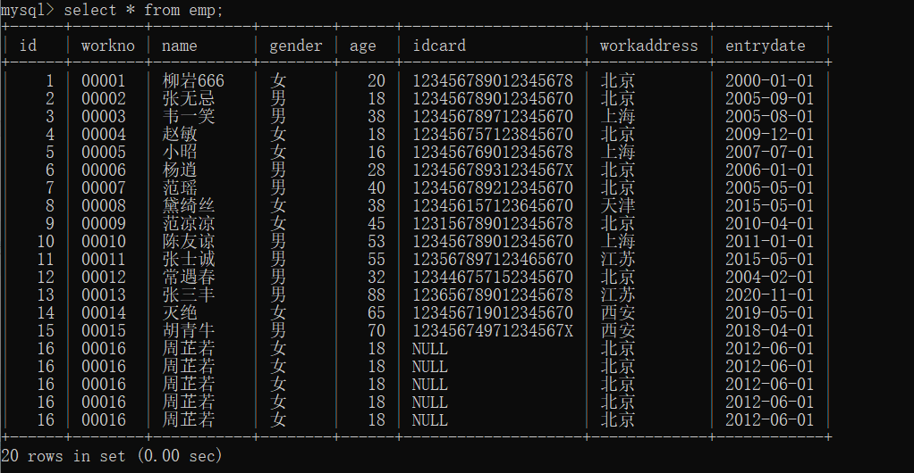

根据字段去重：

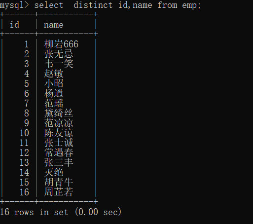

#### 条件的查询：

```mysql
SELECT 字段列表 FROM 表名 WHERE 条件列表 ;


```

##### 比较运算符：

```mysql
\>  大于

\>= 大于等于

< 小于

<= 小于等于

= 等于

<> 或 

!= 不等于

BETWEEN ... AND ... 在某个范围之内(含最小、最大值)

IN(...) 在in之后的列表中的值，多选一

LIKE 占位符 模糊匹配(_匹配单个字符, %匹配任意个字符) 一般进行基本的模糊的匹配操作

IS NULL   是NULL
```

##### 逻辑运算符：

```mysql
AND 或 && 并且 (多个条件同时成立)
OR 或 || 或者 (多个条件任意一个成立)
NOT 或 ! 非 , 不是
```

案例：

```mysql
select * from emp where age=88;
select * from emp where age=20;
```

查询：

```mysql
查询指定的字段
select id,name,age from emp;

去重复的操作
select  distinct id,name from emp;

查询所有字段，并选出age=88的
select * from emp where age=88;
select * from emp where age=20;
查询所有的字段，并选出年林大于20 de
select *
from emp where age>20;

select *
from emp where age<60;

查询出身份证号不为空的
SELECT * FROM emp WHERE idcard IS  NULL ;
查询出有多个查询条件的
SELECT * from emp where age=20 or age=40 or age=18;

查询出名字为俩个字的
select *
from emp where name like '__';
查询出结尾为X的身份证号的
select *
from emp where idcard like '%X';

select *
from emp where idcard like '_________________X';
```

#### 聚合函数：

将

一列数据作为一个整体，进行纵向的计算

```mysql
函数 功能
count 统计数量
max 最大值
min 最小值
avg 平均值
sum 求和
```

实列：

```mysql
统计身份证不为空的
select count(idcard)
from emp;

统计平均的年龄
select avg(age) from emp;

统计最大
select max(age) from emp;

统计最小
select min(age)
from emp;

统计求和
select sum(age)
from emp;
```


#### 分组查找：

```mysql
SELECT 字段列表 FROM 表名 [ WHERE 条件 ] GROUP BY 分组字段名 [ HAVING 分组
后过滤条件 ];
```

######  where与having区别

执行时机不同：where是分组之前进行过滤，不满足where条件，不参与分组；而having是分组

之后对结果进行过滤。

判断条件不同：where不能对聚合函数进行判断，而having可以。

执行的顺序：

```mysql
 执行顺序: where > 聚合函数 > having 。
```

```mysql
通过性别分组计数
select gender,count(*)
from emp group by gender;

通过性别分组计数，并统计男性和女性的平均年龄
select gender,avg(age)
from emp group by gender;

查询年龄小于45的员工 , 并根据工作地址分组 , 获取员工数量大于等于2的工作地址
select workaddress, count(*) address_count from emp where age < 45 group by
workaddress having address_count >=2;

 统计各个工作地址上班的男性及女性员工的数量
select workaddress,gender,count(*) '数量'
from emp  group by workaddress,gender;

```


#### 排序查询

基本语法：

```mysql
SELECT 字段列表 FROM 表名 ORDER BY 字段1 排序方式1 , 字段2 排序方式2 ;
```

排序方法：

```mysql
ASC : 升序(默认值)
DESC: 降序
```

练习：

```mysql
年龄升序
select *
from emp order by age;

进入时间降序
select *
from emp order by entrydate desc ;

先年龄升序，后进入时间降序
select *
from emp order by age asc ,entrydate desc ;
```

#### 分页查询

```mysql
SELECT 字段列表 FROM 表名 LIMIT 起始索引, 查询记录数 ; 
```

#### 练习：

```mysql
select *
from emp  where gender='女' and age in (20,21,22,23);

select *
from emp where gender='男' and (age between 20 and 40) and name like '___';

select gender ,COUNT(*) from emp where age<=60 group by gender;
```

#### 执行的顺序：


比如：

```mysql
select name , age from emp where age > 15 order by age asc;
```

第一步：起别名：

```mysql

select e.name , e.age from emp e where e.age > 15 order by age asc;
```


我们可以看到将其别名在select中起好之后再where中无法调用，也就是整个select的操作是再where的垢面的

```mysql
select e.name ename , e.age eage from emp e where e.age > 15 order by eage asc;
```


```mysql
from  -----------------where-------------------select--------- order by
```


执行的实际的顺序：

```mysql
from ... where ... group by ...having ... select ... order by ... limit ...
```

### DCL

数据库控制语言

##### 查询用户

```muysql
select * from mysql.user;
```

查询的结果:


其中 Host代表当前用户访问的主机, 如果为localhost, 仅代表只能够在当前本机访问，是不可以

远程访问的。 User代表的是访问该数据库的用户名。在MySQL中需要通过Host和User来唯一标识一

个用户。

##### 创建用户

```mysql
CREATE USER '用户名'@'主机名' IDENTIFIED BY '密码';
```

##### 修改用户密码

```mysql
ALTER USER '用户名'@'主机名' IDENTIFIED WITH mysql_native_password BY '新密码' ;
```

示例：

```mysql
alter  user 'heima'@'%' identified with  mysql_native_password by '123456';
```


##### 删除用户

```mysql
DROP USER '用户名'@'主机名' ;
```

```mysql
drop user 'itcast'@'localhost'
```


```mysql
查看数据库的用户；
select * from mysql.user;
创建用户itcast, 只能够在当前主机localhost访问, 密码123456;
create user 'itcast'@'localhost' identified by '123456';

select *  from mysql.user;

 创建用户heima, 可以在任意主机访问该数据库, 密码123456;
create user 'itcast'@'%' identified by '123456';

select *from mysql.user;
```

具体的操作：

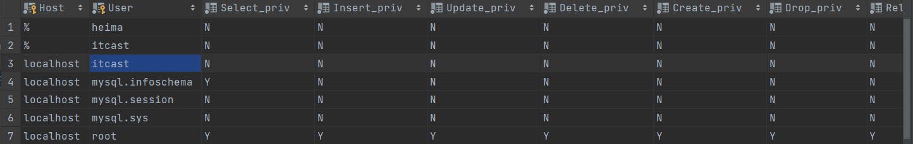

##### 权限的控制；

```mysql
ALL, ALL PRIVILEGES 所有权限
SELECT 查询数据
INSERT 插入数据
UPDATE 修改数据
DELETE 删除数据
ALTER 修改表
DROP 删除数据库/表/视图
CREATE 创建数据库/表
```

查询权限：

```mysql
SHOW GRANTS FOR '用户名'@'主机名' ;
```


授予权限：

```mysql
GRANT 权限列表 ON 数据库名.表名 TO '用户名'@'主机名';
```

撤销权限

```mysql
REVOKE 权限列表 ON 数据库名.表名 FROM '用户名'@'主机名';
```

```mysql
注意事项：
• 多个权限之间，使用逗号分隔
• 授权时， 数据库名和表名可以使用 * 进行通配，代表所有。
```

test

```mysql
show grants for 'heima'@'%';
grant all on itcast.* to 'heima'@'%';
show grants for 'heima'@'%';
```

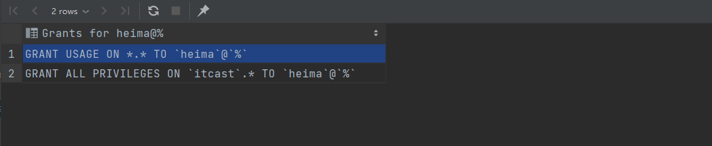

```mysql
revoke all on itcast.* from 'heima'@'%';
```

撤销权限

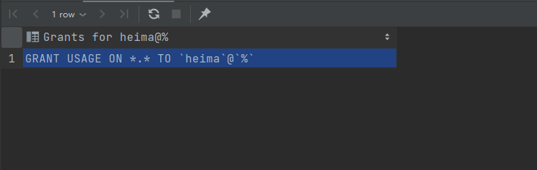

### 函数

#### 字符串函数

```mysql
CONCAT(S1,S2,...Sn) 字符串拼接，将S1，S2，... Sn拼接成一个字符串
LOWER(str) 将字符串str全部转为小写
UPPER(str) 将字符串str全部转为大写
LPAD(str,n,pad) 左填充，用字符串pad对str的左边进行填充，达到n个字符串长度
RPAD(str,n,pad) 右填充，用字符串pad对str的右边进行填充，达到n个字符串长度
TRIM(str) 去掉字符串头部和尾部的空格
SUBSTRING(str,start,len) 返回从字符串str从start位置起的len个长度的字符串
```

使用举例：

```mysql
select concat('hello','mysql');
select  lower('HeLOn');


select lpad(UPPER(concat('hello','mysql')),30,'_');
select rpad(UPPER(concat('hello','mysql')),30,'_');

select  trim(' jeck  what ');
select  substring('hello word',1);

update emp set workno=lpad(workno,5,'0');

select * from emp;
```

#### 数值函数

```mysql
CEIL(x) 向上取整
FLOOR(x) 向下取整
MOD(x,y) 返回x/y的模
RAND() 返回0~1内的随机数
ROUND(x,y) 求参数x的四舍五入的值，保留y位小数
```

#### 日期函数：

```mysql
CURDATE() 返回当前日期
CURTIME() 返回当前时间
NOW() 返回当前日期和时间
YEAR(date) 获取指定date的年份
MONTH(date) 获取指定date的月份
DAY(date) 获取指定date的日期
DATE_ADD(date, INTERVAL expr
type)
返回一个日期/时间值加上一个时间间隔expr后的
时间值
DATEDIFF(date1,date2)
返回起始时间date1 和 结束时间date2之间的天
数
```

示例：

```mysql
当前的日期
select curdate();
当前的时间
select curtime();
当前的日期和时间
select now();
当前的年
select year(now());
当前的月
select month(now());
当前的日
select day(NOW());
增加指定的时间
select date_add(now(), INTERVAL 70 second );
select date_add(now(), INTERVAL 70 day);
select date_add(now(), INTERVAL 70 month );
select date_add(now(), INTERVAL 70 minute );
计算时间差
select datediff('2021-10-01', '2021-12-01');
```

查询所有员工的入职天数，并根据入职天数倒序排序。

思路： 入职天数，就是通过当前日期 - 入职日期，所以需要使用datediff函数来完成。

```mysql
select name,datediff(now(),entrydate) 'entry' from emp order by  entry desc;
```

#### 流程函数

```mysql
IF(value , t , f)        如果value为true，则返回t，否则返回f

IFNULL(value1 , value2) 如果value1不为空，返回value1，否则返回value2

CASE WHEN [ val1 ] THEN [res1] ...ELSE [ default ] END 如果val1为true，返回res1，... 否则返回default默认值

CASE [ expr ] WHEN [ val1 ] THEN[res1] ... ELSE [ default ] END如果expr的值等于val1，返回
res1，... 否则返回default默认值
```

```msql
select if(false, 'Ok', 'Error');
select if(true, 'Ok', 'Error');

select ifnull('Ok', 'Error');
select ifnull('','Default');
select ifnull(null,'Default');

```

需求: 查询emp表的员工姓名和工作地址 (北京/上海 ----> 一线城市 , 其他 ----> 二线城市)

```mysql
select
name,
( case workaddress when '北京' then '一线城市' when '上海' then '一线城市' else
'二线城市' end ) as '工作地址'
from emp;
```

示例：

```mysql
select id,name,(case when math>=85 then '优秀' when math>=60 THEN '及格' else '不及格' end ) '数学',
       (case when english>=85 then '优秀' when english>=60 THEN '及格' else '不及格' end ) '英语',
       (case when chinese>=85 then '优秀' when math>=60 THEN '及格' else '不及格' end ) '语文'

from score;
```

结果：


### 约束：

概念：约束是作用于表中字段上的规则，用于限制存储在表中的数据。

目的：保证数据库中数据的正确、有效性和完整性。


约束是作用在我们的表的字段上面的，可以在创建和修改表的时候添加约束

#### 案例需求：


创建表的语句：

```mysql
CREATE TABLE tb_user(
id int AUTO_INCREMENT PRIMARY KEY COMMENT 'ID唯一标识',
name varchar(10) NOT NULL UNIQUE COMMENT '姓名' ,
age int check (age > 0 && age <= 120) COMMENT '年龄' ,
status char(1) default '1' COMMENT '状态',
gender char(1) COMMENT '性别'
);
```

校验的语句：

```mysql
insert into tb_user_1(name,age,status,gender) values ('Tom1',19,'1','男'),
('Tom2',25,'0','男');
insert into tb_user_1(name,age,status,gender) values ('Tom3',19,'2','男');
insert into tb_user_1(name,age,status,gender) values (null,19,'1','男');
insert into tb_user_1(name,age,status,gender) values ('Tom3',19,'1','男');
insert into tb_user_1(name,age,status,gender) values ('Tom4',80,'1','男');
insert into tb_user_1(name,age,status,gender) values ('Tom5',-1,'1','男');
insert into tb_user_1(name,age,status,gender) values ('Tom5',121,'1','男');
insert into tb_user_1(name,age,gender) values ('Tom5',120,'男');

```

#### 外键的约束

##### 介绍：

外键：**用来让两张表的数据之间建立连接，从而保证数据的一致性和完整性**

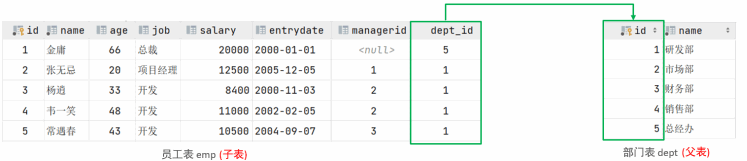

左侧的emp表是员工表，里面存储员工的基本信息，包含员工的ID、姓名、年龄、职位、薪资、入职日

期、上级主管ID、部门ID，在员工的信息中存储的是部门的ID dept_id，而这个部门的ID是关联的

部门表dept的主键id，那emp表的dept_id就是外键,关联的是另一张表的主键

```mysql
注意：目前上述两张表，只是在逻辑上存在这样一层关系；在数据库层面，并未建立外键关联，
所以是无法保证数据的一致性和完整性的。
```

##### 实验：

###### 数据的准备

```mysql
create table dept(
id int auto_increment comment 'ID' primary key,
name varchar(50) not null comment '部门名称'
)comment '部门表';
INSERT INTO dept (id, name) VALUES (1, '研发部'), (2, '市场部'),(3, '财务部'), (4,'销售部'), (5, '总经办');
create table emp1(
id int auto_increment comment 'ID' primary key,
name varchar(50) not null comment '姓名',
age int comment '年龄',
job varchar(20) comment '职位',
salary int comment '薪资',
entrydate date comment '入职时间',
managerid int comment '直属领导ID',
dept_id int comment '部门ID'
)comment '员工表';
INSERT INTO emp1 (id, name, age, job,salary, entrydate, managerid, dept_id)
VALUES
(1, '金庸', 66, '总裁',20000, '2000-01-01', null,5),(2, '张无忌', 20,
'项目经理',12500, '2005-12-05', 1,1),
(3, '杨逍', 33, '开发', 8400,'2000-11-03', 2,1),(4, '韦一笑', 48, '开
发',11000, '2002-02-05', 2,1),
(5, '常遇春', 43, '开发',10500, '2004-09-07', 3,1),(6, '小昭', 19, '程
序员鼓励师',6600, '2004-10-12', 2,1);

```

现在不建立外键的约束

删除我们的部门的信息：

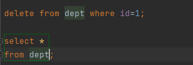

结果：


那么再我们的emp的表格中的信息：

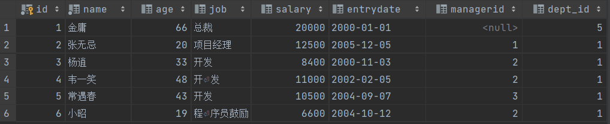

相关的部门的信息依然是存在的，这就会出现数据的不完整性，解决的方法即使外键约束 

##### 语法

###### 添加外键：

```mysql
CREATE TABLE 表名(
字段名 数据类型,
...
[CONSTRAINT] [外键名称] FOREIGN KEY (外键字段名) REFERENCES 主表 (主表列名)
);
```

```mysql
ALTER TABLE 表名 ADD CONSTRAINT 外键名称 FOREIGN KEY (外键字段名)
REFERENCES 主表 (主表列名) ;
```

比如现在为我们的emp1的字段添加一个外键的约束，关联到dept的主键id

```mysql
alter table emp1 add constraint fk_emp_dept_id foreign key (dept_id) references
dept(id);

```

此时删除的时候：


添加了外键约束之后，我们再到dept表(父表)删除id为1的记录，然后看一下会发生什么现象。 此时

将会报错，不能删除或更新父表记录，因为存在外键约束


###### 删除外键：

```mysql
ALTER TABLE 表名 DROP FOREIGN KEY 外键名称;
```

```mysql
ALTER TABLE 表名 DROP FOREIGN KEY 外键名称;
```

###### 删除更新的行为：

添加了外键之后，再删除父表数据时产生的约束行为，我们就称为删除/更新行为。具体的删除/更新行

为有以下几种:

```
NO ACTION
当在父表中删除/更新对应记录时，首先检查该记录是否有对应外键，如果有则不
允许删除/更新。 (与 RESTRICT 一致) 默认行为

RESTRICT
当在父表中删除/更新对应记录时，首先检查该记录是否有对应外键，如果有则不
允许删除/更新。 (与 NO ACTION 一致) 默认行为

CASCADE
当在父表中删除/更新对应记录时，首先检查该记录是否有对应外键，如果有，则
也删除/更新外键在子表中的记录。

SET NULL
当在父表中删除对应记录时，首先检查该记录是否有对应外键，如果有则设置子表
中该外键值为null（这就要求该外键允许取null）。

SET DEFAULT
父表有变更时，子表将外键列设置成一个默认的值 **(Innodb不支持)**
```

语法：

```mysql
ALTER TABLE 表名 ADD CONSTRAINT 外键名称 FOREIGN KEY (外键字段) REFERENCES
主表名 (主表字段名) ON UPDATE CASCADE ON DELETE CASCADE;


```

cascade级联的效果；

```mysql
alter table emp1 add constraint fk_emp_dept_id foreign key (dept_id) references dept(id)
on update cascade on delete cascade ;

```


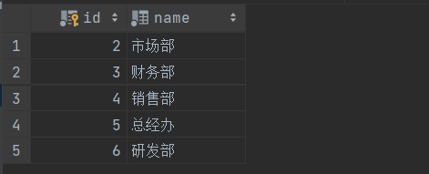


我们发现，原来在子表中dept_id值为1的记录，现在也变为6了，这就是cascade级联的效果。

set null

```
alter table emp1 add constraint fk_emp_dept_id foreign key (dept_id) references
dept(id) on update set null on delete set null ;
```

删除id 为6 的操作

```mysql
delete from dept where id=6;
```


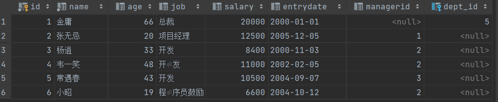

我们发现父表的记录是可以正常的删除的，父表的数据删除之后，再打开子表 emp，我们发现子表emp

的dept_id字段，原来dept_id为1的数据，现在都被置为NULL了。


### 多表查询

#### 多表之间的关系

项目开发中，在进行数据库表结构设计时，会根据业务需求及业务模块之间的关系，分析并设计表结

构，由于业务之间相互关联，所以各个表结构之间也存在着各种联系，基本上分为三种：

一对多

多对多

一对一

##### 一对多：

案例: 部门 与 员工的关系

关系: 一个部门对应多个员工，一个员工对应一个部门

实现: 在多的一方建立外键，指向一的一方的主键

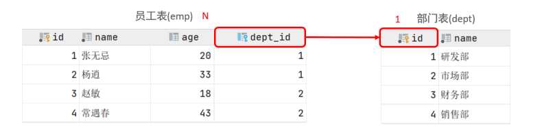


##### 多对多

案例: 学生 与 课程的关系

关系: 一个学生可以选修多门课程，一门课程也可以供多个学生选择

实现: 建立第三张中间表，中间表至少包含两个外键，分别关联两方主键

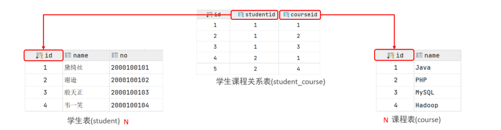


多对多代码设计实现：

```mysql
create table student1(
id int auto_increment primary key comment '主键ID',
name varchar(10) comment '姓名',
no varchar(10) comment '学号'
) comment '学生表';
insert into student1 values (null, '黛绮丝', '2000100101'),(null, '谢逊',
'2000100102'),(null, '殷天正', '2000100103'),(null, '韦一笑', '2000100104');
create table course1(
id int auto_increment primary key comment '主键ID',
name varchar(10) comment '课程名称'
) comment '课程表';
insert into course1 values (null, 'Java'), (null, 'PHP'), (null , 'MySQL') ,
(null, 'Hadoop');


create table student_course(
id int auto_increment comment '主键' primary key,
studentid int not null comment '学生ID',
courseid int not null comment '课程ID',
constraint fk_courseid foreign key (courseid) references course (id),
constraint fk_studentid foreign key (studentid) references student (id)
)comment '学生课程中间表';
insert into student_course values (null,1,1),(null,1,2),(null,1,3),(null,2,2),
(null,2,3),(null,3,4);
```

##### 一对一的操作：

案例: 用户 与 用户详情的关系

关系: 一对一关系，多用于单表拆分，将一张表的基础字段放在一张表中，其他详情字段放在另

一张表中，以提升操作效率

实现: 在任意一方加入外键，关联另外一方的主键，并且设置外键为唯一的(UNIQUE)

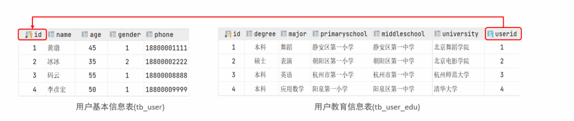

对应的代码：

```mysql
create table tb_user(
id int auto_increment primary key comment '主键ID',
name varchar(10) comment '姓名',
age int comment '年龄',
gender char(1) comment '1: 男 , 2: 女',
phone char(11) comment '手机号'
) comment '用户基本信息表';

create table tb_user_edu(
id int auto_increment primary key comment '主键ID',
degree varchar(20) comment '学历',
major varchar(50) comment '专业',
primaryschool varchar(50) comment '小学',
middleschool varchar(50) comment '中学',
university varchar(50) comment '大学',
userid int unique comment '用户ID',
constraint fk_userid foreign key (userid) references tb_user(id)
) comment '用户教育信息表';


insert into tb_user(id, name, age, gender, phone) values
(null,'黄渤',45,'1','18800001111'),
(null,'冰冰',35,'2','18800002222'),
(null,'码云',55,'1','18800008888'),
(null,'李彦宏',50,'1','18800009999');
insert into tb_user_edu(id, degree, major, primaryschool, middleschool,
university, userid) values
(null,'本科','舞蹈','静安区第一小学','静安区第一中学','北京舞蹈学院',1),
(null,'硕士','表演','朝阳区第一小学','朝阳区第一中学','北京电影学院',2),
(null,'本科','英语','杭州市第一小学','杭州市第一中学','杭州师范大学',3),
(null,'本科','应用数学','阳泉第一小学','阳泉区第一中学','清华大学',4);

```


##### 数据准备：

```mysql
-- 创建dept表，并插入数据
create table dept(
id int auto_increment comment 'ID' primary key,
name varchar(50) not null comment '部门名称'
)comment '部门表';
INSERT INTO dept (id, name) VALUES (1, '研发部'), (2, '市场部'),(3, '财务部'), (4,
'销售部'), (5, '总经办'), (6, '人事部');
-- 创建emp表，并插入数据
create table emp(
id int auto_increment comment 'ID' primary key,
name varchar(50) not null comment '姓名',
age int comment '年龄',
job varchar(20) comment '职位',
salary int comment '薪资',
entrydate date comment '入职时间',
managerid int comment '直属领导ID',
dept_id int comment '部门ID'
)comment '员工表';
-- 添加外键
alter table emp add constraint fk_emp_dept_id foreign key (dept_id) references
dept(id);
INSERT INTO emp (id, name, age, job,salary, entrydate, managerid, dept_id)
VALUES
(1, '金庸', 66, '总裁',20000, '2000-01-01', null,5),
(2, '张无忌', 20, '项目经理',12500, '2005-12-05', 1,1),
(3, '杨逍', 33, '开发', 8400,'2000-11-03', 2,1),
(4, '韦一笑', 48, '开发',11000, '2002-02-05', 2,1),
(5, '常遇春', 43, '开发',10500, '2004-09-07', 3,1),
(6, '小昭', 19, '程序员鼓励师',6600, '2004-10-12', 2,1),
(7, '灭绝', 60, '财务总监',8500, '2002-09-12', 1,3),
(8, '周芷若', 19, '会计',48000, '2006-06-02', 7,3),
(9, '丁敏君', 23, '出纳',5250, '2009-05-13', 7,3),
(10, '赵敏', 20, '市场部总监',12500, '2004-10-12', 1,2),
(11, '鹿杖客', 56, '职员',3750, '2006-10-03', 10,2),
(12, '鹤笔翁', 19, '职员',3750, '2007-05-09', 10,2),
(13, '方东白', 19, '职员',5500, '2009-02-12', 10,2),
(14, '张三丰', 88, '销售总监',14000, '2004-10-12', 1,4),
(15, '俞莲舟', 38, '销售',4600, '2004-10-12', 14,4),
(16, '宋远桥', 40, '销售',4600, '2004-10-12', 14,4),
(17, '陈友谅', 42, null,2000, '2011-10-12', 1,null);
```

多表查询其实就是多张表中查询数据

```mysql
原来查询单表数据，执行的SQL形式为：

select * from emp;


那么我们要执行多表查询，就只需要使用逗号分隔多张表即可，如： 


select * from emp , dept

```

此时,我们看到查询结果中包含了大量的结果集，总共102条记录，而这其实就是员工表emp所有的记录

(17) 与 部门表dept所有记录(6) 的所有组合情况，这种现象称之为笛卡尔积。接下来，就来简单

介绍下笛卡尔积


在SQL语句中，如何来去除无效的笛卡尔积呢？ 我们可以给多表查询加上连接查询的条件即可。(多表查询消除笛卡尔积，就是加上连接查询的条件)

```mysql
select * from emp , dept where emp.dept_id = dept.id;
```

#### 连接查询：

内连接：相当于查询A、B交集部分数据

外连接：

左外连接：查询左表所有数据，以及两张表交集部分数据

右外连接：查询右表所有数据，以及两张表交集部分数据

自连接：当前表与自身的连接查询，自连接必须使用表别名

子查询

##### 内连接查询：

内连接查询的是两张表交集部分的数

据。(也就是绿色部分的数据)

内连接的语法分为两种: 隐式内连接、显式内连接。先来学习一下具体的语法结构。


隐式内连接

```
SELECT 字段列表 FROM 表1 , 表2 WHERE 条件 ... ; 1
```

显式内连接

```
SELECT 字段列表 FROM 表1 [ INNER ] JOIN 表2 ON 连接条件 ... ;
```

案例:

A. 查询每一个员工的姓名 , 及关联的部门的名称 (隐式内连接实现)

 表结构: emp , dept

 连接条件: emp.dept_id = dept.id

```mysql
select emp.name , dept.name from emp , dept where emp.dept_id = dept.id ;
-- 为每一张表起别名,简化SQL编写
select e.name,d.name from emp e , dept d where e.dept_id = d.id;
```

显式内连接：

```mysql
select * from emp e join dept d on e.dept_id = d.id;
```

```mysql
select e.name,e.job,e.dept_id,d.id,d.name from emp e join dept d on e.dept_id = d.id;
```

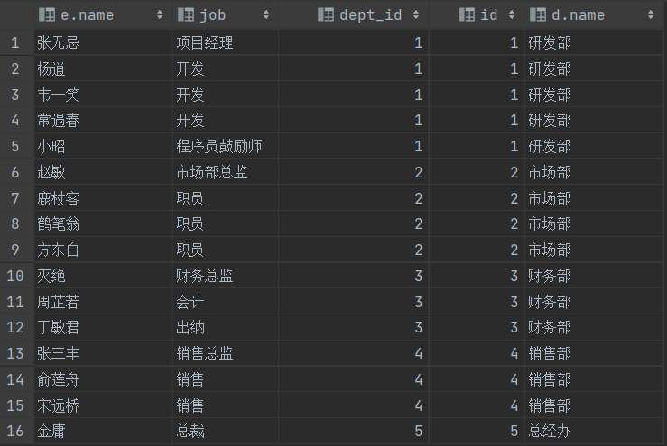

##### 外连接：

外连接分为两种，分别是：左外连接 和 右外连接。具体的语法结构为：

左外连接

```mysql
SELECT 字段列表 FROM 表1 LEFT [ OUTER ] JOIN 表2 ON 条件 ... ; 
```

```nysql
select * from emp e left join dept d on e.dept_id = d.id;

```


左外连接相当于查询表1(左表)的所有数据，当然也包含表1和表2交集部分的数据。

右外连接：

```MYSQL
[SELECT 字段列表 FROM 表1 RIGHT [ OUTER ] JOIN 表2 ON 条件 ... ; ];
```

右外连接相当于查询表2(右表)的所有数据，当然也包含表1和表2交集部分的数据

```
select * from emp e right join dept d on e.dept_id = d.id;
```

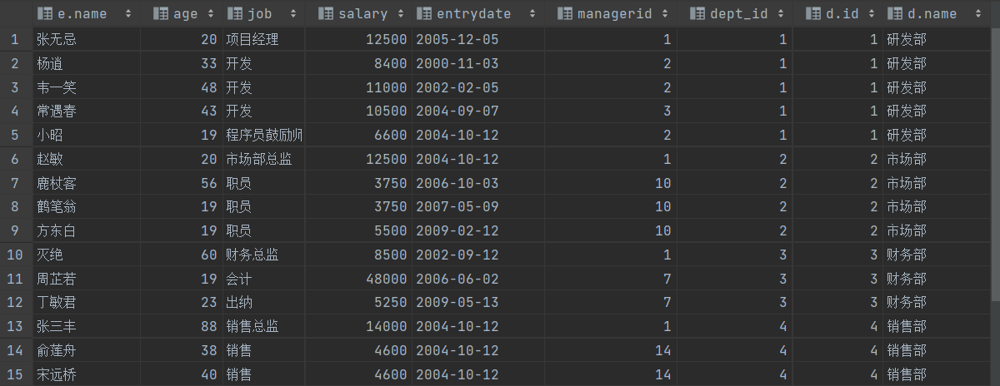


example：

A. 查询emp表的所有数据, 和对应的部门信息

```
select * from emp e left join dept d on e.dept_id = d.id;
```


 查询dept表的所有数据, 和对应的员工信息(右外连接)

```MYSQL
select d.*, e.* from emp e right outer join dept d on e.dept_id = d.id;
```


##### 自连接：

查询的语法：

```mysql
SELECT 字段列表 FROM 表A 别名A JOIN 表A 别名B ON 条件 ... ;
```

查询所有员工 emp 及其领导的名字 emp , 如果员工没有领导, 也需要查询出来

 表结构: emp a , emp b

```mysql
select a.name '员工', b.name '领导' from emp a left join emp b on a.managerid =
b.id;
```


##### 联合查询：

多次查询的结果都合并起来，形成一个新的查询的结果集

```mysql
SELECT 字段列表 FROM 表A ...
UNION [ ALL ]
SELECT 字段列表 FROM 表B ....;
```

对于联合查询的多张表的列数必须保持一致，字段类型也需要保持一致。

union all 会将全部的数据直接合并在一起，union 会对合并之后的数据去重。


实操：

```MYSQL
select * from emp where age>40
union ALL
select * from emp where name LIKE '__';
```

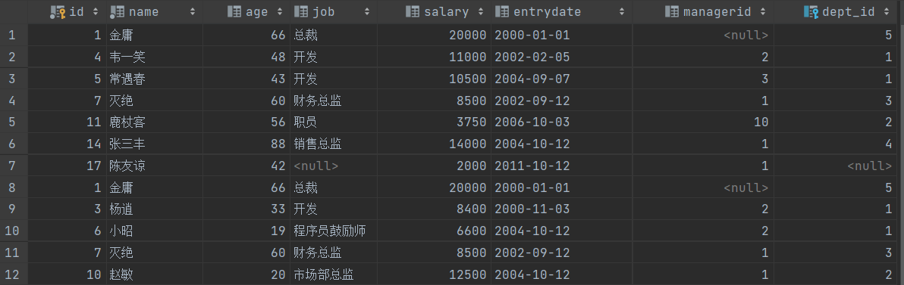

UNION ALL 的区别：

```
select * from emp where age>40
union
select * from emp where name LIKE '__';
```

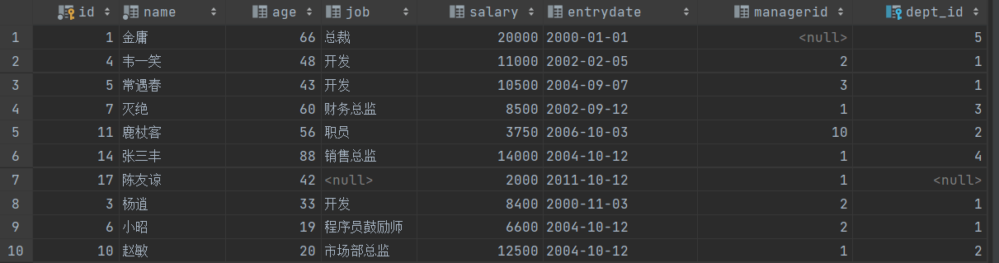

union all 简单的合并

union 会进行去重

##### 子查询：嵌套的select

SQL语句中嵌套SELECT语句，称为嵌套查询，又称子查询。

```mysql
SELECT * FROM t1 WHERE column1 = ( SELECT column1 FROM t2 ); 
```

```
子查询外部的语句可以是INSERT / UPDATE / DELETE / SELECT 的任何一个
```

根据子查询结果不同，分为：

###### A. 标量子查询（子查询结果为单个值）

子查询返回的结果是单个值（数字、字符串、日期等），最简单的形式，这种子查询称为标量子查询。

常用的操作符：= <> > >= < <= 

示例：

A. 查询 "销售部" 的所有员工信息

完成这个需求时，我们可以将需求分解为两步：

①. 查询 "销售部" 部门ID

②. 根据 "销售部" 部门ID, 查询员工信息

```
select * from emp e where e.dept_id=(select id from dept where e.name='市场部');
```

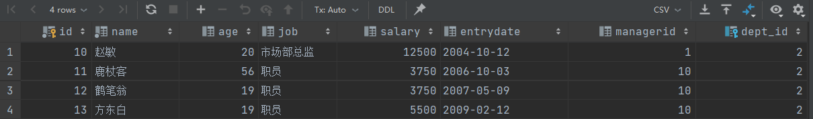

B. 查询在 "方东白" 入职之后的员工信息

完成这个需求时，我们可以将需求分解为两步：

```MYSQL
select * from emp e where e.entrydate>(select entrydate from emp where name='方东白');
```


###### B. 列子查询(子查询结果为一列)

子查询返回的结果是一列（可以是多行），这种子查询称为列子查询。

常用的操作符：IN 、NOT IN 、 ANY 、SOME 、 ALL

```mysql
IN 在指定的集合范围之内，多选一
NOT IN 不在指定的集合范围之内
ANY 子查询返回列表中，有任意一个满足即可
SOME 与ANY等同，使用SOME的地方都可以使用ANY
ALL 子查询返回列表的所有值都必须满足
```

例如：

. 查询 "销售部" 和 "市场部" 的所有员工信息

```mysql
select * from emp where id in (select id from dept where name='销售部' or  name='研发部');
```

###### C. 行子查询(子查询结果为一行)

子查询返回的结果是一行（可以是多列），这种子查询称为行子查询。

常用的操作符：= 、<> 、IN 、NOT IN

例如：

查询与 "张无忌" 的薪资及直属领导相同的员工信息 ;

```mysql
select * from emp where (salary,managerid) = (select salary, managerid from emp
where name = '张无忌');
```

###### D. 表子查询(子查询结果为多行多列)

子查询返回的结果是多行多列，这种子查询称为表子查询。

常用的操作符：IN

举例子：

```
 查询与 "鹿杖客" , "宋远桥" 的职位和薪资相同的员工信息
```

```mysql
select * from emp where (job,salary) in ( select job, salary from emp where name =
'鹿杖客' or name = '宋远桥' );
```

查询入职日期是“2006-01-01”之后的员工信息，及其部门的信息

```mysql
select e.*, d.* from (select * from emp where entrydate > '2006-01-01') e left
join dept d on e.dept_id = d.id ;
```

### 事务：

事务 是一组操作的集合，它是一个不可分割的工作单位，事务会把所有的操作作为一个整体一起向系

统提交或撤销操作请求，即这些操作要么同时成功，要么同时失败。

就比如: 张三给李四转账1000块钱，张三银行账户的钱减少1000，而李四银行账户的钱要增加

1000。 这一组操作就必须在一个事务的范围内，要么都成功，要么都失败

正常情况: 转账这个操作, 需要分为以下这么三步来完成 , 三步完成之后, 张三减少1000, 而李四

增加1000, 转账成功 :

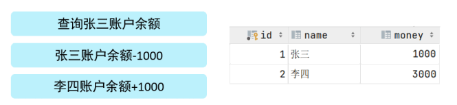

异常情况: 转账这个操作, 也是分为以下这么三步来完成 , 在执行第三步是报错了, 这样就导致张

三减少1000块钱, 而李四的金额没变, 这样就造成了数据的不一致, 就出现问题了。


为了解决上述的问题，就需要通过数据的事务来完成，我们只需要在业务逻辑执行之前开启事务，执行

完毕后提交事务。如果执行过程中报错，则回滚事务，把数据恢复到事务开始之前的状态。

##### 事务的操作：

数据的准备:

```MYSQL
drop table if exists account;
create table account(
id int primary key AUTO_INCREMENT comment 'ID',
name varchar(10) comment '姓名',
money double(10,2) comment '余额'
) comment '账户表';
insert into account(name, money) VALUES ('张三',2000), ('李四',2000);
```

正常的情况：

```mysql
-- 1. 查询张三余额
select * from account where name = '张三';
-- 2. 张三的余额减少1000
update account set money = money - 1000 where name = '张三';
-- 3. 李四的余额增加1000
update account set money = money + 1000 where name = '李四';
```

```mysql
张三 1000
李四 3000
```

但是当出现中间出错的时候，就会导致数据出问题：

###### 控制事务1：

查看设置事物的提交的方式

```mysql
SELECT @@autocommit ;
SET @@autocommit = 0 ;
```

提交事物

```mysql
COMMIT;
```

回滚事务：

```mysql
ROLLBACK;
```

上述的这种方式，我们是修改了事务的自动提交行为, 把默认的自动提交修改为了手动提交, 此时我们执行的DML语句都不会提交, 需要手动的执行commit进行提交

###### 控制事务2:

开启事务：

```
START TRANSACTION 或 BEGIN ;
```

提交事务：

```
COMMIT;
```

回滚事务

```
ROLLBACK;
```

```mysql
-- 开启事务
start transaction
-- 1. 查询张三余额
select * from account where name = '张三';

update account set money = money - 1000 where name = '张三';

update account set money = money + 1000 where name = '李四';

commit;
-- 如果执行过程中报错, 则回滚事务
-- rollback;
```

完成操作

否则事务回滚

```mysql

-- 开启事务
start transaction;
-- 1. 查询张三余额
select * from account where name = '张三';
-- 2. 张三的余额减少1000
update account set money = money - 1000 where name = '张三';
-- 3. 李四的余额增加1000
update account set money = money + 1000 where name = '李四';
-- 如果正常执行完毕, 则提交事务
commit;
-- 如果执行过程中报错, 则回滚事务
rollback;
```


##### 事务的特性：（ACID）

```
原子性（Atomicity）：事务是不可分割的最小操作单元，要么全部成功，要么全部失败。
（事务不再可分）

一致性（Consistency）：事务完成时，必须使所有的数据都保持一致状态。

隔离性（Isolation）：数据库系统提供的隔离机制，保证事务在不受外部并发操作影响的独立
环境下运行。

持久性（Durability）：事务一旦提交或回滚，它对数据库中的数据的改变就是永久的。
上述就是事务的四大特性，简称ACID。
```

###### 脏读：

```
 赃读：一个事务读到另外一个事务还没有提交的数据。
```


###### 不可重复读：

不可重复读：一个事务先后读取同一条记录，但两次读取的数据不同，称之为不可重复读。

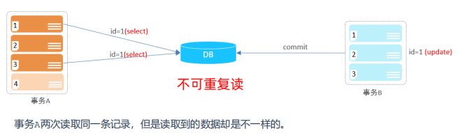

###### 幻读：

幻读：一个事务按照条件查询数据时，没有对应的数据行，但是在插入数据时，又发现这行数据

已经存在，好像出现了 "幻影"。

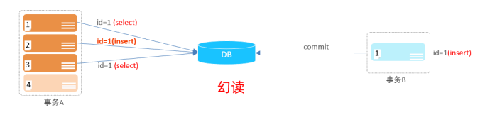

##### 事务的隔离的机制

为了解决并发事务所引发的问题，在数据库中引入了事务隔离级别。主要有以下几种：

```mysql
隔离级别           脏读             不可重复读               幻读
Read uncommitted   √                 √                     √
Read committed     ×                 √                     √
Repeatable Read(默认) ×               ×                     √
Serializable       ×                 ×                     ×
```

查看事务的隔离的级别

```mysql
SELECT @@TRANSACTION_ISOLATION;
```

默认的隔离的级别为**Repeatable Read**


设置事务的隔离级别：

```mysql
SET [ SESSION | GLOBAL ] TRANSACTION ISOLATION LEVEL { READ UNCOMMITTED |
READ COMMITTED | REPEATABLE READ | SERIALIZABLE }
```

注意：事务隔离级别越高，数据越安全，但是性能越低。

执行的命令：

```mysql
set session  transaction isolation level read committed ;
set session  transaction isolation level read uncommitted ;
set session transaction isolation level REPEATABLE READ ;
set session transaction isolation level SERIALIZABLE ;
```


##### 观察其事务隔离的机制：

使用俩个窗口执行我们的并发的事务：


###### 脏读的问题：

第一步检查数据：


开启控制事务：

并更新数据，但是没有提交事务，却读取到未提交的事务；这就是我们的脏读；


设置为Read committed的隔离机制此时就可以解决脏读的问题：

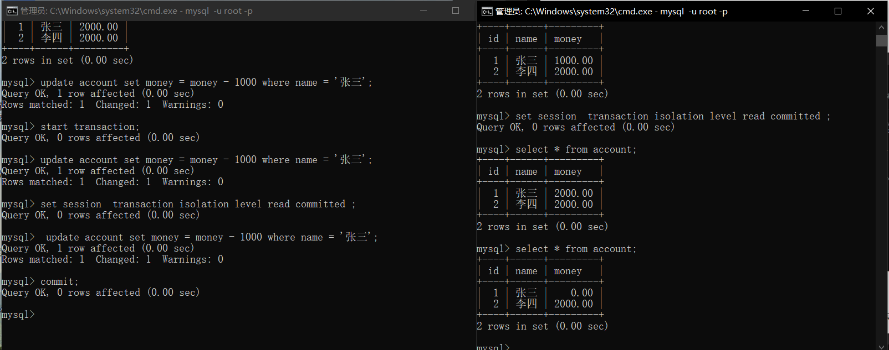

###### 不可重复读的问题：


## 数据库进阶：

### 体系结构


从MySQL的架构图，我们可以看出MySQL的架构自顶向下大致可以分为**网络连接层**、**数据库服务层**、**存储引擎层**和**系统文件层**四大部分。接下来，我们就来简单说说每个部分的组成信息。

##### 1). 连接层

最上层是一些客户端和链接服务，包含本地sock 通信和大多数基于客户端/服务端工具实现的类似于

TCP/IP的通信。主要完成一些类似于连接处理、授权认证、及相关的安全方案。在该层上引入了线程

池的概念，为通过认证安全接入的客户端提供线程。同样在该层上可以实现基于SSL的安全链接。服务器也会为安全接入的每个客户端验证它所具有的操作权限。

##### 2). 服务层

第二层架构主要完成大多数的核心服务功能，如SQL接口，并完成缓存的查询，SQL的分析和优化，部

分内置函数的执行。所有跨存储引擎的功能也在这一层实现，如 过程、函数等。在该层，服务器会解

析查询并创建相应的内部解析树，并对其完成相应的优化如确定表的查询的顺序，是否利用索引等，

最后生成相应的执行操作。如果是select语句，服务器还会查询内部的缓存，如果缓存空间足够大，

这样在解决大量读操作的环境中能够很好的提升系统的性能。

##### 3). 引擎层

存储引擎层， 存储引擎真正的负责了MySQL中数据的存储和提取，服务器通过API和存储引擎进行通

信。不同的存储引擎具有不同的功能，这样我们可以根据自己的需要，来选取合适的存储引擎。数据库中的索引是在存储引擎层实现的。

##### 4). 存储层

数据存储层， 主要是将数据(如: redolog、undolog、数据、索引、二进制日志、错误日志、查询

日志、慢查询日志等)存储在文件系统之上，并完成与存储引擎的交互。

#### 存储引擎------->表的类型

存储引擎就是存储数据、建立索引、更新/查询数据等技术的实现方式 。

**存储引擎是基于表的**，而不是基于库的，所以**存储引擎也可被称为表类型**。我们可以在创建表的时候，来指定选择的存储引擎，如果

没有指定将自动选择默认的存储引擎。

建表时指定存储的引擎：

```mysql
CREATE TABLE 表名(
字段1 字段1类型 [ COMMENT 字段1注释 ] ,
......
字段n 字段n类型 [COMMENT 字段n注释 ]
) ENGINE = INNODB [ COMMENT 表注释 ] ;
```

查询当前的数据库支持的类型”：

```mysql
show engines;
```

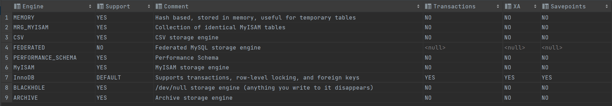

查询建表的语句：

```mysql
show create table account;
```


在创建表的时候我们如果没有指定这个表的存储的引擎，数据库会默认选择存储的引擎。

##### 举例子：

创建表 my_memory , 指定Memory存储引擎

```mysql
create table my_memory(
id int,
name varchar(10)
) engine = Memory ;
```

#### 存储引擎的特点：

### 索引：

一种数据结构，用于高效的获取数据

#### 演示：

无索引的时候：

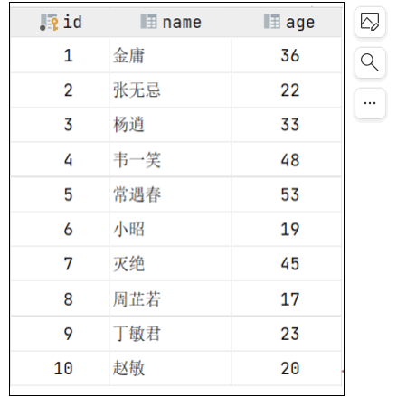

在无索引情况下，就需要从第一行开始扫描，一直扫描到最后一行，我们称之为全表扫描，性能很

低。

###### 有索引的时候：

如果我们针对于这张表建立了索引，假设索引结构就是二叉树，那么也就意味着，会对age这个字段建

立一个二叉树的索引结构


索引的优缺点：

```
优势                                                               劣势
提高数据检索的效率，降低数据库
的IO成本
                                                           索引列也是要占用空间的。
通过索引列对数据进行排序，降低
数据排序的成本，降低CPU的消
耗。
                                                    索引大大提高了查询效率，同时却也降低更新表的                                                      速度，如对表进行INSERT、UPDATE、DELETE                                                         时，效率降低。
```

#### 索引的结构：

| 索引的结构     | 描述                                                         |
| -------------- | ------------------------------------------------------------ |
| B+Tree索引     | 最常见的索引类型，大部分引擎都支持 B+ 树索引                 |
| Hash索引       | 底层数据结构是用哈希表实现的, 只有精确匹配索引列的查询才有效, 不支持范围查询 |
| R-tree(空间索  | 空间索引是MyISAM引擎的一个特殊索引类型，主要用于地理空间数据类。通常的使用是比较少的 |
| Full-text(全文 | 是一种通过建立倒排索引,快速匹配文档的方式。类似于Lucene,Solr,ES |

引擎对索引的支持情况：

| 索引           | InnoDB     | MYISAM | Memory |
| -------------- | ---------- | ------ | ------ |
| B+Tree索引     | 支持       | 支持   | 支持   |
| Hash索引       | 不支持     | 不支持 | 支持   |
| R-tree(空间索  | 不支持     | 支持   | 不支持 |
| Full-text(全文 | 5.6 后支持 | 支持   | 不支持 |

##### 二叉树：


如果主键是顺序插入的时候，会形成一个单向的链表

单数当数据主键是顺序插入的时候：


所以，如果选择二叉树作为索引结构，会存在以下缺点：

顺序插入时，会形成一个链表，查询性能大大降低。

大数据量情况下，层级较深，检索速度慢。


这个时候我们可能会想到自平衡的二叉树，红黑树


但是，即使如此，由于红黑树也是一颗二叉树，所以也会存在一个缺点：


大数据量情况下，层级较深，检索速度慢。


##### B—tree结构：

```
B-Tree，B树是一种多叉路衡查找树，相对于二叉树，B树每个节点可以有多个分支，即多叉。
以一颗最大度数（max-degree）为5(5阶)的b-tree为例，那这个B树每个节点最多存储4个key，5个指针：
```


插入的时候：

```
100 65 169 368 900 556 780 35 215 1200 234 888 158 90 1000 88

120 268 250 
```

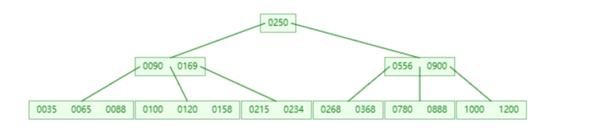

```
特点：
5阶的B树，每一个节点最多存储4个key，对应5个指针。
一旦节点存储的key数量到达5，就会裂变，中间元素向上分裂。
在B树中，非叶子节点和叶子节点都会存放数据
```

##### **B+Tree**

B+Tree是B-Tree的变种，我们以一颗最大度数（max-degree）为4（4阶）的b+tree为例，来看一

下其结构示意图：

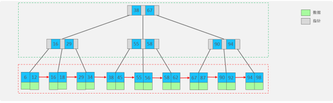

我们可以看到，两部分：

绿色框框起来的部分，是索引部分，仅仅起到索引数据的作用，不存储数据。

红色框框起来的部分，是数据存储部分，在其叶子节点中要存储具体的数据。


最终我们看到，B+Tree 与 B-Tree相比，主要有以下三点区别：

**所有的数据都会出现在叶子节点**。

**叶子节点形成一个单向链表。**

**非叶子节点仅仅起到索引数据作用，具体的数据都是在叶子节点存放的。**

上述我们所看到的结构是标准的B+Tree的数据结构，接下来，我们再来看看MySQL中优化之后的

B+Tree。

MySQL索引数据结构对经典的B+Tree进行了优化。在原B+Tree的基础上，增加一个指向相邻叶子节点

的链表指针，就形成了带有顺序指针的B+Tree，提高区间访问的性能，利于排序

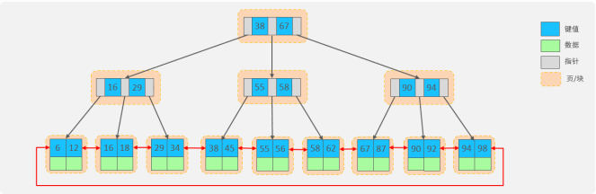

##### **Hash**

MySQL中除了支持B+Tree索引，还支持一种索引类型---Hash索引。

1). 结构

哈希索引就是采用一定的hash算法，将键值换算成新的hash值，映射到对应的槽位上，然后存储在

hash表中


如果两个(或多个)键值，映射到一个相同的槽位上，他们就产生了hash冲突（也称为hash碰撞），可以通过链表来解决。


2). 特点

A. Hash索引只能用于对等比较(=，in)，不支持范围查询（between，>，< ，...）

B. 无法利用索引完成排序操作

C. 查询效率高，通常(不存在hash冲突的情况)只需要一次检索就可以了，效率通常要高于B+tree索

引

3). 存储引擎支持

在MySQL中，支持hash索引的是Memory存储引擎。 而InnoDB中具有自适应hash功能，hash索引是

InnoDB存储引擎根据B+Tree索引在指定条件下自动构建的。

```
为什么Innodb存储引擎选择使用B+tree索引结构

A. 相对于二叉树，层级更少，搜索效率高；

B. 对于B-tree，无论是叶子节点还是非叶子节点，都会保存数据，这样导致一页中存储的键值减少，指针跟着减少，要同样保存大量数据，只能增加树的高度，导致性能降低；
此外只存放索引，也可以使得整个的IO效率大幅度的提高


C. 相对Hash索引，B+tree支持范围匹配及排序操作；
```

#### 索引的分类：

在MySQL数据库，将索引的具体类型主要分为以下几类：主键索引、唯一索引、常规索引、全文索引


当我们为我们指定的字段创建对应的字段的约束的时候，其会自动的 创建一个对应的唯一索引

###### 索引的分类：

**聚集索引***&**二级索引**

| 分类     | 含义                                                       | 特点           |
| -------- | ---------------------------------------------------------- | -------------- |
| 聚集索引 | 将数据存储与索引放到了一块，索引结构的叶子节点保存了行数据 | 必须有只有一个 |
| 二级索引 | 将数据与索引分开存储，索引结构的叶子节点关联的是对应的主键 | 可以存在多个   |

聚集索引选取规则:

如果存在主键，主键索引就是聚集索引。

如果不存在主键，将使用第一个唯一（UNIQUE）索引作为聚集索引。

如果表没有主键，或没有合适的唯一索引，则InnoDB会自动生成一个rowid作为隐藏的聚集索

引。

###### 聚集索引和二级索引的结构


聚集索引的叶子节点下挂的是这一行的数据 。

二级索引的叶子节点下挂的是该字段值对应的主键值。

###### SQL语句的的查询过程

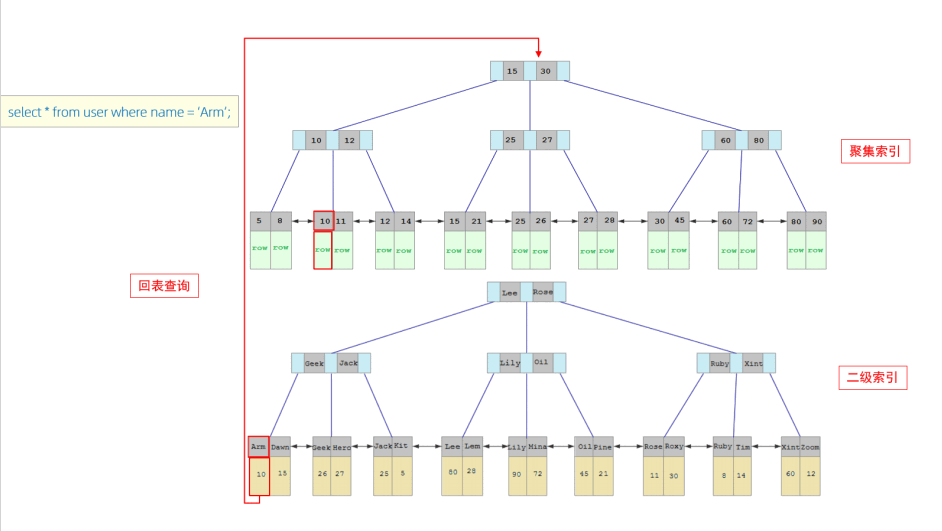

具体过程如下:


①. 由于是根据name字段进行查询，所以先根据name='Arm'到name字段的二级索引中进行匹配查

找。但是在二级索引中只能查找到 Arm 对应的主键值 10。

②. 由于查询返回的数据是*，所以此时，还需要根据主键值10，到聚集索引中查找10对应的记录，最终找到10对应的行row。（**回表查询**）

③. 最终拿到这一行的数据，直接返回即可。


```
1.先走Name的二级索引，查找到对应的主键
2.通过聚集索引中，通过主键ID查到对应的row
3.最终定位到我们这一行的数据，直接返回。
```


什么是回表查xun?

```
回表查询： 这种先到二级索引中查找数据，找到主键值，然后再到聚集索引中根据主键值，获取
数据的方式，就称之为回表查询。
```


#### **索引语法**

##### 创建索引

```
CREATE [ UNIQUE | FULLTEXT ] INDEX index_name ON table_name (
index_col_name,... ) ;
```

为姓名创建字段；

```
CREATE INDEX idx_user_name ON tb_user(name); 
```

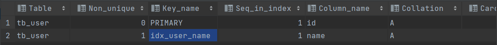

手机号创建唯一索引：

```
CREATE UNIQUE INDEX idx_user_phone ON tb_user(phone); 
```

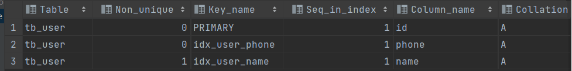

创建profession,age ,status,创建联合索引

```
create index pf_age_status_index on tb_user(profession,age,status);
```

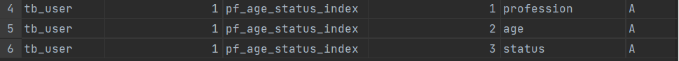

##### 查看索引

```
SHOW INDEX FROM table_name ;
```

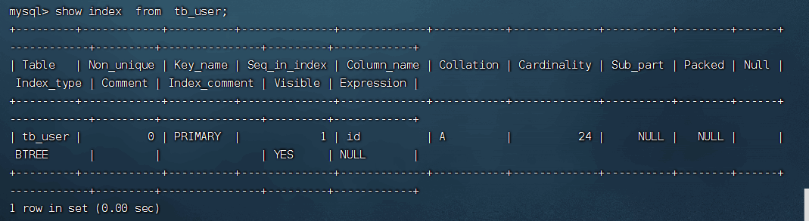

##### 删除索引

```
DROP INDEX index_name ON table_name ;
```

##### 案例演示：

###### 创建表：

```
create table tb_user(
id int primary key auto_increment comment '主键',
name varchar(50) not null comment '用户名',
phone varchar(11) not null comment '手机号',
email varchar(100) comment '邮箱',
profession varchar(11) comment '专业',
age tinyint unsigned comment '年龄',
gender char(1) comment '性别 , 1: 男, 2: 女',
status char(1) comment '状态',
createtime datetime comment '创建时间'
) comment '系统用户表';
```


#### **SQL性能分析**

主要优化索引：

##### SQL的执行的频率：

MySQL 客户端连接成功后，通过show [session|global] status 命令可以提供服务器状态信息。通过如下指令，可以查看当前数据库的INSERT、UPDATE、DELETE、SELECT的访问频次：

```
-- session 是查看当前会话 ;
-- global 是查询全局数据 ;
SHOW GLOBAL STATUS LIKE 'Com_______';
```

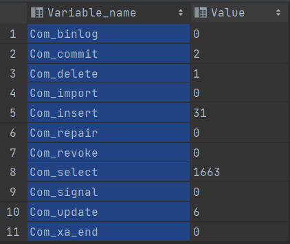


查询当前的数据库 的增删查改的频次；

由于我们前期有插入数据的操作，因此砸门的数据的插入的频次比较

执行查询：

```
select *
from tb_user;
```

查看数据库的使用频次：

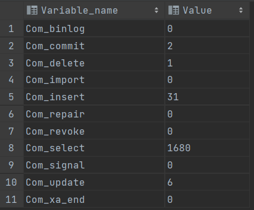

前面的这一部分感觉是像分析我们的每个SQL的操作的频次，比如分析插入还是分析我们的查询和更新删除。

但是具体到那一句SQL的效率较低的时候我们就需要去找对应的效率较低的SQL的语句，例如采用我们的慢查询的日志，可以记录我们查询超过指定时间的的所有的SQL的语句；

##### 慢查询日志：

慢查询日志记录了所有执行时间超过指定参数（long_query_time，单位：秒，默认10秒）的所有

SQL语句的日志。

MySQL的慢查询日志默认没有开启，我们可以查看一下系统变量 slow_query_log。

查看慢查询日志是否开启：

```
show variables  like 'slow_query_log';
```

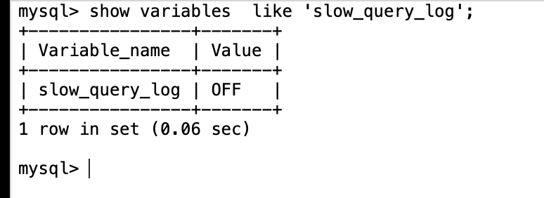

如果要开启慢查询日志，需要在MySQL的配置文件（/etc/my.cnf）中配置如下信息：

```
# 开启MySQL慢日志查询开关
slow_query_log=1
# 设置慢日志的时间为2秒，SQL语句执行时间超过2秒，就会视为慢查询，记录慢查询日志
long_query_time=2
```

配置完毕之后，通过以下指令重新启动MySQL服务器进行测试，查看慢日志文件中记录的信息

```
/var/lib/mysql/localhost-slow.log。
```

重启我们的mysql的服务器：

```
systemctl restart mysqld
```

并查询我们的慢查询日志是否开启：

```
show variables  like 'slow_query_log';

```


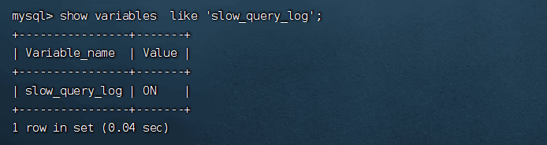

```
select * from tb_user; -- 这条SQL执行效率比较高, 执行耗时 0.00sec
select count(*) from tb_sku; -- 由于tb_sku表中, 预先存入了1000w的记录, count一次,耗时
13.35sec
```


```
慢查询日志是否日志是否生成
//其存放的位置
cd  /var/lib/mysql
```


打开这个的时候

```
cat localhost-slow.log
```


最终我们发现，在慢查询日志中

只会记录执行时间超多我们预设时间（2s）的SQL

执行较快的SQL

是不会记录的。

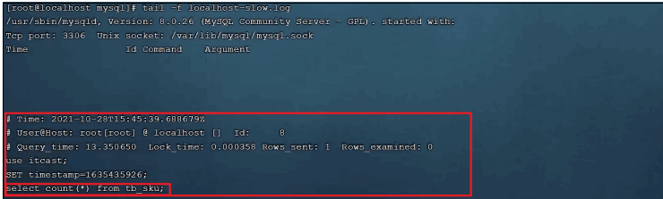

那这样，通过慢查询日志，就可以**定位出执行效率比较低的SQL**，从而有针对性的进行优化。

这个只会记录我们的设置超过指定时间的mysql 的命令

##### profile详情

show profiles 能够在做SQL优化时帮助我们了解时间都耗费到哪里去了。通过have_profiling

参数，能够看到当前MySQL是否支持profile操作：

查询是否支持我们的profile

```
select @@have_profiling;
```


可以看到，当前MySQL是支持 profile操作的，但是开关是关闭的。可以通过set语句在

session/global级别开启profiling：

```
SET profiling = 1;
```

```
select * from tb_user;
select * from tb_user where id = 1;
select * from tb_user where name = '白起';
select count(*) from tb_sku;
```

执行一系列的业务的SQL的操作，然后通过指令查找执行的耗时：

```
 show profiles
```


查看指定query_id的SQL语句各个阶段的耗时情况

```
show profile for query query_id;
```

```
show profile for query 1;
```


查看指定query_id的SQL语句CPU的使用情况

```
show profile cpu for query query_id;
```

```
show profile cpu for query 1;
```


##### explain：

EXPLAIN 或者 DESC命令获取 MySQL 如何执行 SELECT 语句的信息，包括在 SELECT 语句执行过程中表如何连接和连接的顺序。

```
-- 直接在select语句之前加上关键字 
explain / desc  EXPLAIN SELECT 字段列表 FROM 表名 WHERE 条件 ;
```


```
ID：select查询的序列号，表示查询中执行select子句或者操作表的顺序，（ID 相同，执行的顺序从上到下，；id不同执行的顺序从大到小，数值越大越显执行）

```

演示：


例如上图所示的结果而言：

```s
ID树枝相同，则执行的效果从上到下
  先执行的s
  之后执行的是e
  之后执行的是sc
```

```
select * from student s where s.id in (select studentid from   student_course  sc where sc.courseid=select id from  course  c where c.name='MySQL');
```


```
数值大的先执行，那么就是我们的c 表先执行
之后就是我们的sc 表的执行
再接着就按照顺序来
最后执行我们的student的表
```

```
type 
表示连接的类型，性能由好到差的规程类型：
NUll,   一般是业务不存在这样的访问的表
system, 访问系统表
const,  比较好的（主键查询，唯一索引查询）
eq_ref,  
ref,range,  非唯一的索引会导致出现ref
index,all
```

possible_key

```
可能用到的索引
```

key

```
实际用到的索引
```

Key_len

```
索引中使用的字节数，一般是越短越好
```

rows

```
表示我们的执行的行数，一般是一个估计数值，结果不是可靠准确的
```

filtered

```
越大越好
```


#### 索引的使用

观察索引的使用能否提高我们的数据查询的性能；

##### 创建索引：

```
create index idx_sku_sn on tb_sku(sn) ; 
```

##### 查询语句：

```
SELECT * FROM tb_sku WHERE sn = '100000003145001';
```

##### 最左前缀法则：

如果索引了多列（联合索引），要遵守最左前缀法则。最左前缀法则指的是查询从索引的最左列开始，并且不跳过索引中的列。如果跳跃某一列，索引将会部分失效(后面的字段索引失效)。

以 tb_user 表为例，我们先来查看一下之前 tb_user 表所创建的索引。


在 tb_user 表中，有一个联合索引，这个联合索引涉及到三个字段，顺序分别为：profession，age，status。

对于最左前缀法则指的是，查询时，最左边的列，也就是profession必须存在，否则索引全部失效。

而且中间不能跳过某一列，否则该列后面的字段索引将失效。 接下来，我们来演示几组案例，看一下

具体的执行计划：

比如：

```
explain select * from tb_user where profession = '软件工程' and age = 31 and status= '0';
```


```
explain select * from tb_user where profession = '软件工程' and age = 31;
```


```    5
explain select * from tb_user where profession = '软件工程';
```

****

以上的这三组测试中，我们发现只要联合索引最左边的字段 profession存在，索引就会生效，只不过索引的长度不同。 而且由以上三组测试，我们也可以推测出profession字段索引长度为47、age字段索引长度为2、status字段索引长度为5。

**遵循最左前缀法则，并且不能跳过，一旦跳过只走最左边的索引，中间的一旦被跳过就只走最左边和跳过字段之间的部分的索引字段**

##### 范围查询：

联合索引中，出现范围查询(>,<)，范围查询右侧的列索引失效。

```
explain select * from tb_user where profession = '软件工程' and age > 30 and status= '0';
```

##### 索引失效：

###### 索引的列运算

不要再索引的列上进行函数的运算操作，否则索引可能出现失效

###### 字符串不加单引号

字符串的类型的字段的使用不添加引号的时候，索引将失效。为啥呢？其实是不加这个引号的时候，内部存在这个隐式的转换操作

实验：


出现索引失效的时候：


索引正常使用：


###### 模糊查询：

如果是尾部的模糊匹配的时候，索引不会失效。但是一旦出现头部的模糊匹配就会出现了索引失效。

案例0:


案例一：


###### or连接的条件：

使用or分割开的条件，如果or前的条件中的列有索引，而后面的列中没有索引，那么涉及到的索引都不会被用到。

```
explain select * from student1 where id=0 or name='韦一笑';
```

案例：


当前存在主键索引：


实际的查询中不存在我们的索引的使用；


Or 连接的俩侧必须都有索引，否则就会出现索引的失效的情况，也就是索引不会起作用；

解决方法：

为我们的俩侧查询的字段均添加相关的索引：


这个时候o r连接的俩个索引就对应起来了


通过这种使得SQL语句的效率提升，消除我们的索引失效

###### 数据分布影响：

假如全表的扫描比我们的走索引更高效，这个时候就会直接使用全表的扫描。

会自动的根据我们的数据的分布来进行判断，走那一条路更为高效。

#####  SQL提示：

SQL 提示是优化数据库的一个重要的手段，简单来说，就是在SQL语句中加入一些认为的提示来达到优化操作的目的。


使用这个index索引

```
use index

```

```
select * from tb_user use index(index_user_pro) where profession='软件工程'
```

不使用某一索引

```
ignore index；
```

```
select * from tb_user ignore index(index_user_pro) where profession='软件工程'
```

强制使用某一索引

```
force index；
```

```
select * from tb_user force index(index_user_pro) where profession='软件工程'
```

实验：创建一个联合索引；


```
explain select * from student where name='韦一笑'

```


发现当前的字段存在多个索引；

系统默认的是联合索引当我们使用SQL的提示控制其索引的使用的时候。

```java
explain select * from student use index(idx_stu) where name='韦一笑'
```


这种方式可以使得我们针对一些字段出现多个索引的时候，我们可以灵活的进行选择。

##### 覆盖索引：

尽量使用覆盖索引（查询使用了索引，并且需要返回的列，在该索引中已经能够全部找到），减少select *

出现：

```
using index condition 查询使用了索引，但是需要回表查询数据

using where。或者 using index 查找使用了索引，但是需要的数据在索引列中都可以找到，不需要回表查询数据。

```


只需要遍历一次索引进行查询得到目标的 结果。


一次索引扫描的结果可以覆盖我们的select的内容。


下面这个中查询的 无法覆盖我们的select的内容需要我们的再次使用ID去聚集索引查询得到相关的数据。


##### 前缀索引：

当字段类型为字符串(varchar，text，longtext等)时，有时候需要索引很长的字符串，这会让 索引变得很大，查询时，浪费大量的磁盘IO， 影响查询效率。此时可以只将字符串的一部分前缀，建立索引，这样可以大大节约索引空间，从而提高索引效率。

```
create index idx_xxxx on table_name(column(n)) ;
```

为tb_user表的email字段，建立长度为5的前缀索引。

```
create index idx_email_5 on tb_user(email(5));

```

前缀的长度：

可以根据索引的选择性来决定，而选择性是指不重复的索引值(基数)和数据表的记录总数的比值，

索引选择性越高则查询效率越高， 唯一索引的选择性是1，这是最好的索引选择性，性能也是最好的。

```
select  count(distinct email) / count(*)   from  tb_user ;

select  count(distinct substring(email,1,5)) / count(*)  from  tb_user ;
```


有单列的索引和联合的索引；

联合索引的情况：依然属于二级索引其叶子结点中挂着的是我们的 ID主键。


#### 索引设计原则

1). 针对于数据量较大，且查询比较频繁的表建立索引（量大查询品次高）。

2). 针对于常作为查询条件(where)、排序(order by)、分组(group by)操作的字段建立索引。

3). 尽量选择区分度高的列作为索引，尽量建立唯一索引，区分度越高，使用索引的效率越高。

4). 如果是字符串类型的字段，字段的长度较长，可以针对于字段的特点，建立前缀索引。

5). 尽量使用联合索引，减少单列索引，查询时，联合索引很多时候可以覆盖索引，节省存储空间，避免回表，提高查询效率。

6). 要控制索引的数量，索引并不是多多益善，索引越多，维护索引结构的代价也就越大，会影响增删改的效率。

7). 如果索引列不能存储NULL值，请在创建表时使用NOT NULL约束它。当优化器知道每列是否包含 NULL值时，它可以更好地确定哪个索引最有效地用于查询。

### SQL的优化

#### 插入优化：

##### inset优化：

批量的插入（单次插入不超入千条）

手动提交事务：手动控制事务的开启和关闭。

主键的顺序的插入的操作：

##### 大批量的数据的加载：

如果一次性需要插入大批量数据(比如: 几百万的记录)，使用insert语句插入性能较低，此时可以使用MySQL数据库提供的load指令进行插入。操作如下


```
-- 客户端连接服务端时，加上参数 --local-infile mysql –-local-infile -u root -p
-- 设置全局参数local_infile为1，开启从本地加载文件导入数据的开关 set global local_infile = 1;
-- 执行load指令将准备好的数据，加载到表结构中
load data local infile '/root/sql1.log' into table tb_user fields terminated by ',' lines terminated by '\n' ;
```

实验：

加入我们有百万的数据需要加载到我们的指定的数据库中

```
CREATE TABLE 'tb_user11' (
  'id' INT(11) NOT NULL AUTO_INCREMENT,
  'username' VARCHAR(50) NOT NULL,
  'password' VARCHAR(50) NOT NULL,
  'name' VARCHAR(20) NOT NULL,
  'birthday' DATE DEFAULT NULL,
  'sex' CHAR(1) DEFAULT NULL,
  PRIMARY KEY ('id'),
  UNIQUE KEY 'unique_user_username' ('username')
) ENGINE=INNODB DEFAULT CHARSET=utf8 ;
```

第一步：将我们的系统中的数据拷贝到我们的docker容器中

```
docker cp /root/load_user_100w_sort.sql mysql01:root;
```

第二步：打开我们的SQL，添加一个加载的命令的参数（表示我们需要加载本地的文件）：

```
docker exec -it mysql01 bash
mysql --local-infile -u root -p

```

第三步：进入后设置从本地导入数据的开关

```
set global local_infile = 1;
```

第四步：找到我们之前的数据的位置

开始加载：

```
load data local infile '/root/load_user_100w_sort.sql' into table tb_user1 fields terminated by ',' lines terminated by '\n' ;
```


加载速度非常快十九秒加载结束；

#### 主键的优化：

在InnoDB存储引擎中，表数据都是根据主键顺序组织存放的，这种存储方式的表称为索引组织表(index organized table IOT)。

我们的数据都是按照主键的索引来存放的


###### 页分裂：

页可以为空，也可以填充一半，也可以填充100%。每个页包含了2-N行数据(如果一行数据过大，会行溢出)，根据主键排列。

 主键顺序插入：


主键乱序插入的情况：


此时按照我们的想法可能人为此时会为我们的ID为50的新开一个页吗？


原叶子结点有顺序，此时一般是不会直接开辟一个新的页空间


开辟新的数据页：


将一半的数据从1号数据页迁移到三号数据页，之后再插入数据


实际的页分裂之后，其实是存在一些问题的，例如这个三个页面的位置其实不对，所以还需💊重新进行排序；


重新设置链表的顺序，调整链表，完成数据页的排序链表的连接

###### 页合并：

当我们页的已有的数据达到当页的数据的百分之五十的时候，我们I n nodb会查找他相邻好的页是否存在可以合并的情况，如果存在则将其进行合并优化我们的空间的使用。


```
MERGE_THRESHOLD:合并页的阈值，可以自己设置，在创建表或者创建索引时指定。
```

这个合并的阈值是我们可以进行认为的指定的。

###### 主键设计的原则：

满足业务需求的情况下，尽量降低主键的长度。

插入数据时，尽量选择顺序插入，选择使用AUTO_INCREMENT自增主键。 

尽量不要使用**UUID**做主键或者是其他自然主键，如身份证号。 

业务操作时，避免对主键的修改。

##### **order by**优化：

MySQL的排序，有两种方式:

Using filesort : 通过表的索引或全表扫描，读取满足条件的数据行，然后在排序缓冲区sort buffer中完成排序操作，所有不是通过索引直接返回排序结果的排序都叫 FileSort 排序。

Using index : 通过有序索引顺序扫描直接返回有序数据，这种情况即为 using index，不需要 额外排序，操作效率高。

对于以上的两种排序方式，Using index的性能高，而Using filesort的性能低，我们在优化排序 操作时，尽量要优化为 Using index。

实验：

```
explain select id,name,age from emp1 order by age;
```


```
 explain select id,name,age from emp1 order by age,salary;
```


```
create index index_age_salary_union on emp1(age,salary)
```

俩个默认都是升序的时候。

```
explain select id,age,salary from emp1 order by age,salary;
```


一个升序一个降序的时候：

```
explain select id,age,salary from emp1 order by age asc,salary desc;
```

 

这个是因为我们在创建索引的时候，默认联合索引都为升序，因此这里一旦使用一个升序一个降序就会出现useing file sort的情况

解决的方法：

在我们设计联合索引的时候可以一个升序一个降序的设计：如下

删除原联合索引：

```
drop index  index_age_salary_union  on emp1;
```

设计索引一个升序一个降序：

```
create index index_age_salsry_unoin on emp1(age asc,salary desc);
```

查询：


###### order by优化原则:

A. 根据排序字段建立合适的索引，多字段排序时，也遵循最左前缀法则。

B. 尽量使用覆盖索引，避免出现回表查询的问题。

C. 多字段排序, 一个升序一个降序，此时需要注意联合索引在创建时的规则(ASC/DESC)。

D. 如果不可避免的出现filesort，大数据量排序时，可以适当增大排序缓冲区大小 sort_buffer_size(默认256k)。

##### **group by**优化：

分组操作，我们主要来看看索引对于分组操作的影响。

无索引的时候执行的group by 的操作：

```
explain select profession , count(*) from tb_user group by profession ;
```


创建索引：

```
create index idx_user_pro_age_sta on tb_user(profession , age , status);
```


再执行如下的分组查询SQL，查看执行计划:


我们发现，如果仅仅根据age分组，就会出现 Using temporary ;而如果是 根据 profession,age两个字段同时分组，则不会出现 Using temporary。原因是因为对于分组操作， 在联合索引中，也是符合最左前缀法则的。

分组优化的原则：

A. 在分组操作时，可以通过索引来提高效率。

B. 分组操作时，索引的使用也是满足最左前缀法则的。

##### Limit优化：

在数据量比较大时，如果进行limit分页查询，在查询时，越往后，分页查询效率越低。

优化思路: 一般分页查询时，通过创建 覆盖索引 能够比较好地提高性能，可以通过覆盖索引加子查 询形式进行优化。

```
explain select * from tb_sku t , (select id from tb_sku order by id limit 2000000,10) a where t.id = a.id;
```

##### Count 优化：

```
select count(*) from tb_user ;
```


count() :

是一个聚合函数，对于返回的结果集，一行行地判断，如果 count 函数的参数不是

NULL，累计值就加 1，否则不加，最后返回累计值。

用法:

```
count(*)、count(主键)、count(字段)、count(数字)
```


```
按照效率排序的话，count(字段) < count(主键 id) < count(1) ≈ count(*)，所以尽 量使用 count(*)。
```

##### **update**优化:

```
update course set name = 'javaEE' where id = 1 ;
```

ID进行查找后update的我们其实进行的是行锁


但是当我们在执行如下SQL时。当我们开启多个事务，在执行上述的SQL时，我们发现行锁升级为了表锁。 导致该update语句的性能 大大降低。

```
update course set name = 'SpringBoot' where name = 'PHP' ;
```


InnoDB的行锁是针对索引加的锁，不是针对记录加的锁 ,并且该索引不能失效，否则会从行锁 升级为表锁 。


**其实就是我们在update的时候我们需要进行按照索引进行更新，不然使用别的字段很可能导致其行锁升级为表锁从而大大的降低我们的update的 效率**

### 视图/存储过程/触发器

#### 视图： 

视图(View)是一种虚拟存在的表。视图中的数据并不在数据库中实际存在，行和列数据来自定义视 图的查询中使用的表，并且是在使用视图时动态生成的。

视图(View)是一种**虚拟存在的表**。视图中的数据并不在数据库中实际存在，行和列数据来自定义视 图的查询中使用的表，并且是在使用视图时动态生成的。

通俗的讲，**视图只保存了查询的SQL逻辑，不保存查询结果**。所以我们在创建视图的时候，主要的工作 就落在创建这条SQL查询语句上。

##### 语法：

创建：

```
CREATE [OR REPLACE] VIEW 视图名称[(列名列表)] AS SELECT语句 [ WITH [ CASCADED | LOCAL ] CHECK OPTION ]
```


```
create  or replace view mystu_view as select id,name from stu where id <10 with cascaded check option;
```


>>>>>>> ffcad93 (windows_mysql01)
查询：

```
查看创建视图语句:
SHOW CREATE VIEW 视图名称; 
查看视图数据:
SELECT * FROM 视图名称 ...... ;
```


```
select * from mydatsset.mystu_view;
```


>>>>>>> ffcad93 (windows_mysql01)
修改：

```
方式一:CREATE [OR REPLACE] VIEW 视图名称[(列名列表)] AS SELECT语句 [ WITH [ CASCADED | LOCAL ] CHECK OPTION ]
```

```
方式二:ALTER VIEW 视图名称[(列名列表)] AS SELECT语句 [ WITH [ CASCADED | LOCAL ] CHECK OPTION ]
```


测试：

```
select * from mydatsset.mystu_view;

alter view mystu_view as select * from stu where stu.id<8 with cascaded check option ;


show create view mystu_view;
```


```
select * from mydatsset.mystu_view;
```


>>>>>>> ffcad93 (windows_mysql01)
删除：

```
DROP VIEW [IF EXISTS] 视图名称 [,视图名称] ...
```

演示：

```
-- 创建视图
create or replace view stu_v_1 as select id,name from stu where id <= 10;
-- 查询视图
show create view stu_v_1;
select * from stu_v_1;
select * from stu_v_1 where id < 3;
-- 修改视图
create or replace view stu_v_1 as select id,name,no from student where id <= 10;
alter view stu_v_1 as select id,name from student where id <= 10;
-- 删除视图
drop view if exists stu_v_1;
```


结果：


视图创建 查询 修改 删除的操作之后，我门考虑使用视图来插入、更新的操作

```
create or replace view stu_v_1 as select id,name from student where id <= 10 ;
select * from stu_v_1;
insert into stu_v_1 values(6,'Tom');
insert into stu_v_1 values(17,'Tom22');
```

执行以上的S QL的操作的时候，我们会发现，id为6和17的数据都是可以成功插入的。 但是我们执行查询，查询出 来的数据，却没有id为17的记录。

因为我们在创建视图的时候，指定的条件为 id<=10, id为17的数据，是不符合条件的，所以没有查 询出来，但是这条数据确实是已经成功的插入到了基表中。

如果我们定义视图时，如果指定了条件，然后我们在插入、修改、删除数据时，是否可以做到必须满足 条件才能操作，否则不能够操作呢? 答案是可以的，这就需要借助于视图的检查选项了。

##### 检查选项：

当使用WITH CHECK OPTION子句创建视图时，MySQL会通过视图检查正在更改的每个行，例如 插 入，更新，删除，以使其符合视图的定义。 MySQL允许基于另一个视图创建视图，它还会检查依赖视 图中的规则以保持一致性。为了确定检查的范围，mysql提供了两个选项: CASCADED 和 LOCAL ，默认值为 CASCADED 。

```

我们举个例子：

在这里我们考虑使用视图来插入数据：

首先创建视图：

```
create  or replace view mystu_view as select id,name from stu where id <10


此时没有设置相关的检查项的设置；

我们在这个检查视图的内容


然后执行插入的操作：

insert into mydatsset.mystu_view values (8,2,'Tom');

insert into mydatsset.mystu_view values (18,3,'Tam');

执行结束：


数据被插入到我们的基表中现在是存在数据的；

这个时候我们要是去用视图查询所有的数据，会过滤调我们插入的不符合其视图的条件；ID为17的数据现在不存在了怎么办呢？


这个情况中，我们假如针对我们的视图进行增删改的操作，我们最好是需要对其进行设置检查；


设置了将检查项目，因此与我们的视角不符合的数据不会被输入进去

insert into mydatsset.mystu_view values (6,2,'Tom');

insert into mydatsset.mystu_view values (17,3,'Tam');


设置了检查项：


###### CASCADED：级联

比如，v2视图是基于v1视图的，如果在v2视图创建的时候指定了检查选项为 cascaded，但是v1视图

创建时未指定检查选项。 则在执行检查时，不仅会检查v2，还会级联检查v2的关联视图v1。


```
判别所有的依赖的视图是不是满足我们的所有依赖的视图
如下图所示，其会检查所有的条件是不是满足我们的条件的
```


###### LOCAL： 本地

比如，v2视图是基于v1视图的，如果在v2视图创建的时候指定了检查选项为 local ，但是v1视图创 建时未指定检查选项。 则在执行检查时，知会检查v2，不会检查v2的关联视图v1。


##### 视图的更新：

视图要是想更新。那么视图中的行和基础表中的行必须存在一对一的关系，但是要是视图中包含以下任何一项，则该视图不可更新；

A. 聚合函数或窗口函数(SUM()、 MIN()、 MAX()、 COUNT()等) 
B. DISTINCT
C. GROUP BY
D. HAVING
E. UNION 或者 UNION ALL


##### 视图的作用：

1). 简单

视图不仅可以简化用户对数据的理解，也可以简化他们的操作。那些被经常使用的查询可以被定义为视

图，从而使得用户不必为以后的操作每次指定全部的条件。

2). 安全

数据库可以授权，但不能授权到数据库特定行和特定的列上。通过视图用户只能查询和修改他们所能见到的数据

3). 数据独立 视图可帮助用户屏蔽真实表结构变化带来的影响。


#### 存储过程：

存储过程是事先经过编译并存储在数据库中的一段 SQL 语句的集合，调用存储过程可以简化应用开发 人员的很多工作，减少数据在数据库和应用服务器之间的传输，对于提高数据处理的效率是有好处的。

存储过程思想上很简单，就是数据库 SQL 语言层面的代码封装与重用。


封装，复用 -----------------------> 可以把某一业务SQL封装在存储过程中，需要用到 的时候直接调用即可。


可以接收参数，也可以返回数据 --------> 再存储过程中，可以传递参数，也可以接收返回值。


减少网络交互，效率提升 -------------> 如果涉及到多条SQL，每执行一次都是一次网络传 输。 而如果封装在存储过程中，我们只需要网络交互一次可能就可以了。


##### 基础语法：

创建：

```
CREATE PROCEDURE 存储过程名称 ([ 参数列表 ])
BEGIN
-- SQL语句 
END ;
```


调用：

```
CALL 名称 ([参数]);
```

举例子：

```
create procedure P1() BEGIN
    SELECT * FROM stu;
end;
```

调用：

```
stu_v_1
```


```
查看：

SELECT * FROM INFORMATION_SCHEMA.ROUTINES WHERE ROUTINE_SCHEMA = 'xxx'; -- 查询指定数据库的存储过程及状态信息


SHOW CREATE PROCEDURE 存储过程名称 ; -- 查询某个存储过程的定义


删除：

DROP PROCEDURE [ IF EXISTS ] 存储过程名称 ;
```

示例：

查询当前数据库中的定义的存储过程：

```
SELECT * FROM INFORMATION_SCHEMA.ROUTINES WHERE ROUTINE_SCHEMA ='mydatsset';
```

运行的结果：


查询我们的定义的存储过程的定义：

```
show create procedure P1;
```


删除我们的存储过程的定义：

```
drop procedure if exists p1;
```

检查是否存在存储过程的有关的定义：

```
SELECT * FROM INFORMATION_SCHEMA.ROUTINES WHERE ROUTINE_SCHEMA ='mydatsset';
```

返回的结果为空

注意:
在命令行中，执行创建存储过程的SQL时，需要通过关键字 delimiter 指定SQL语句的 结束符。


演示实例：

-- 存储过程基本语法

```
-- 创建
create procedure p1() begin
    select count(*) from student;
end;


-- 调用 call p1();
-- 查看


select * from information_schema.ROUTINES where ROUTINE_SCHEMA = 'itcast';


show create procedure p1;
-- 删除
drop procedure if exists p1;
```


##### 变量：

在MySQL中变量分为三种类型: 系统变量、用户定义变量、局部变量。

###### 查看系统变量：

系统变量 是MySQL服务器提供，不是用户定义的，属于服务器层面。分为全局变量(GLOBAL)、会话变量(SESSION)。

SHOW [ SESSION | GLOBAL ] VARIABLES ; -- 查看所有系统变量

```
show  global variables ;
```


SHOW [ SESSION | GLOBAL ] VARIABLES LIKE '......'; -- 可以通过LIKE模糊匹配方
式查找变量

```
show session variables ;
```


SELECT @@[SESSION | GLOBAL] 系统变量名; -- 查看指定变量的值

###### 设置系统变量：

```
SET [ SESSION | GLOBAL ] 系统变量名 = 值 ; 
SET @@[SESSION | GLOBAL]系统变量名 = 值 ;


```

注意: 如果没有指定SESSION/GLOBAL，**默认是SESSION**，会话变量。

1 mysql服务重新启动之后，所设置的全局参数会失效，要想不失效，可以在 /etc/my.cnf 中配置。			

A. 全局变量(GLOBAL): 全局变量针对于所有的会话。
B. 会话变量(SESSION): 会话变量针对于单个会话，在另外一个会话窗口就不生效了。


演示实例：

```
-- 查看系统变量
show session variables ;
show session variables like 'auto%';
show global variables like 'auto%';
select @@global.autocommit;
准确查看我们指定的变量的数值
select @@session.autocommit;
准确的查看我们的指定的变量的数值的问题
-- 设置系统变量
set session autocommit = 1;
insert into course(id, name) VALUES (6, 'ES');
set global autocommit  = 0;
select @@global.autocommit;
```

手动设置系统变量的举例子：

```
select  @@session.autocommit;
```


表示当前的是事务自动提交是打开的

```
set session autocommit=0;
```

关闭当前自动的提交的窗口变量；


当前的系统变量已经关闭

```
insert into course(id, name) VALUES (6, 'ES');
```

插入数据进行


数据没插入

说明没有提交事务自动

```
 commit；
```

手动提交之后：


结果：


###### 用户变量定义：

用户定义变量 是用户根据需要自己定义的变量，用户变量不用提前声明，在用的时候直接用 "@变量名" 使用就可以。其作用域为当前连接

###### 设置用户变量：

赋值时，可以使用 = ，也可以使用 := 。

方式一：

```
SET   @var_name = expr  [, @var_name = expr] ... ;

SET   @var_name := expr  [, @var_name := expr] ... ;
```


方式二：

```
SELECT @var_name := expr [, @var_name := expr] ... ; 

SELECT 字段名 INTO @var_name FROM 表名;
```


###### 用户变量的使用：

```
SELECT @var_name ;
```


演示实例：

```
-- 赋值
set @myname = 'itcast';
set @myage := 10;
set @mygender := '男',@myhobby := 'java';
select @mycolor := 'red';
select count(*) into @mycount from tb_user;
-- 使用
select @myname,@myage,@mygender,@myhobby;
select @mycolor , @mycount;

```

演示：

演示用户变量的设置和选择：

```
set @myname='itest';
set @myage=10;
set @mygender='男',@myhobby='java';
```

演示结果：使用我们的变量

```
select @myname,@myage,@mycount,@mygenderm,@myhobby;
```


局部变量：

```
局部变量 是根据需要定义的在局部生效的变量，访问之前，需要DECLARE声明。可用作存储过程内的局部变量和输入参数，局部变量的范围是在其内声明的**BEGIN ... END**块。

定义（声明）：

DECLARE 变量名 变量类型 [DEFAULT ... ] ;


变量类型就是数据库字段类型:INT、BIGINT、CHAR、VARCHAR、DATE、TIME等。
```

赋值：

```
SET 变量名=值;
SET 变量名:=值;
SELECT 字段名 INTO 变量名 FROM 表名 ... ;
```


演示：

```
-- 声明局部变量 - declare -- 赋值
create procedure p2() begin
    declare stu_count int default 0;
    select count(*) into stu_count from student;
    select stu_count;
end;
call p2();
```

##### if语句的使用：

if 用作我们的条件的判断，具体的判断的语法的结构为：

```
IF 条件1 THEN
.....
ELSEIF 条件2 THEN -- 可选
.....
ELSE -- 可选
.....
END IF;
```

**在if条件判断的结构中，ELSE IF 结构可以有多个，也可以没有。 ELSE结构可以有，也可以没有。**

创建一个存储的过程然后实现这个的if 的操作：

```
create procedure p2()
begin
    declare score int default 68;
    declare  result varchar(10);

    if score>=80 then
        set result :='优秀';
    end if score>=60 then
        SET  result:='及格';
    ELSE
        SET result:='不及格';
    SELECT result;
end;

call p2;

```

示例：

```
create procedure p2()
begin
    declare score int default 68;
    declare  result varchar(10);

    if score>=80 then
        set result :='优秀';
    elseif score>=60 then
        SET  result:='及格';
    ELSE
        SET result:='不合格';
    end if;
    SELECT result;
end;
```

结果：

##### 参数：

参数的类型，主要分为以下三种：IN、OUT、INOUT。 具体的含义如下

```
输入类型：
IN 该类参数主要用于输入的也就是需要调用时传入的数值

out 此类的参数作为输出，也就是该参数可以作为返回值


INOUT  既可以作为输入的参数也可以作为输出的参数。
```

案例：

根据传入参数score，判定当前分数对应的分数等级，并返回。

score >= 85分，等级为优秀。

score >= 60分 且 score < 85分，等级为及格。

score < 60分，等级为不及格。


```
create procedure p4(in score int, out result varchar(10))
begin
if score >= 85 then
set result := '优秀';
elseif score >= 60 then
set result := '及格';
else
set result := '不及格';
end if;
end;
-- 定义用户变量 @result来接收返回的数据, 用户变量可以不用声明
call p4(18, @result);
select @result;
```

##### case：

流程控制函数相类似

```
-- 含义： 当case_value的值为 when_value1时，执行statement_list1，当值为 when_value2时，
执行statement_list2， 否则就执行 statement_list
CASE case_value
WHEN when_value1 THEN statement_list1
[ WHEN when_value2 THEN statement_list2] ...
[ ELSE statement_list ]
END CASE;
```

##### while的操作：

while 循环是有条件的循环控制语句。满足条件后，再执行循环体中的SQL语句。具体语法为：

```
-- 先判定条件，如果条件为true，则执行逻辑，否则，不执行逻辑
WHILE 条件 DO
SQL逻辑...
END WHILE;
```

##### **repeat**

repeat是有条件的循环控制语句, 当满足until声明的条件的时候，则退出循环 。具体语法为

```
-- 先执行一次逻辑，然后判定UNTIL条件是否满足，如果满足，则退出。如果不满足，则继续下一次循环
REPEAT
SQL逻辑...
UNTIL 条件
END REPEAT;
```

##### Loop 

LOOP 实现简单的循环，如果不在SQL逻辑中增加退出循环的条件，可以用其来实现简单的死循环。

LOOP可以配合一下两个语句使用：

```
[begin_label:] LOOP
SQL逻辑...
END LOOP [end_label];
```

```
LEAVE label; -- 退出指定标记的循环体
ITERATE label; -- 直接进入下一次循环
LEAVE ：配合循环使用，退出循环。
ITERATE：必须用在循环中，作用是跳过当前循环剩下的语句，直接进入下一次循环
```

##### 游标：

游标（CURSOR）是用来存储查询结果集的数据类型 , 在存储过程和函数中可以使用游标对结果集进行循环的处理。游标的使用包括游标的声明、OPEN、FETCH 和 CLOSE，其语法分别如下。

申明游标：

```
DECLARE 游标名称 CURSOR FOR 查询语句 ;
```

打开游标：

```
OPEN 游标名称 ;
```

获取游标的记录

```
FETCH 游标名称 INTO 变量 [, 变量 ] ;
```

关闭游标：

```
CLOSE 游标名称 ; 
```

游标的案例：

```mysql
-- 逻辑:
-- A. 声明游标, 存储查询结果集
-- B. 准备: 创建表结构
-- C. 开启游标
-- D. 获取游标中的记录
-- E. 插入数据到新表中

上述的存储过程，最终我们在调用的过程中，会报错，之所以报错是因为上面的while循环中，并没有
退出条件。当游标的数据集获取完毕之后，再次获取数据，就会报错，从而终止了程序的执行。
但是此时，tb_user_pro表结构及其数据都已经插入成功了，我们可以直接刷新表结构，检查表结构
中的数据。
-- F. 关闭游标


create procedure p11(in uage int)
begin
declare uname varchar(100);
declare upro varchar(100);
declare u_cursor cursor for select name,profession from tb_user where age <=
uage;
drop table if exists tb_user_pro;
create table if not exists tb_user_pro(
id int primary key auto_increment,
name varchar(100),
profession varchar(100)
);
open u_cursor;
while true do
fetch u_cursor into uname,upro;
insert into tb_user_pro values (null, uname, upro);
end while;
close u_cursor;
end;
call p11(30);
```

##### 触发器：

触发器是与表有关的数据库对象，指在insert/update/delete之前(BEFORE)或之后(AFTER)，触

发并执行触发器中定义的SQL语句集合。触发器的这种特性可以协助应用在数据库端确保数据的完整性

, 日志记录 , 数据校验等操作 。

使用别名OLD和NEW来引用触发器中发生变化的记录内容，这与其他的数据库是相似的。现在触发器还

只支持行级触发，不支持语句级触发。


```
触发器类型           NEW 和 OLD
INSERT 型触发器 NEW 表示将要或者已经新增的数据
UPDATE 型触发器 OLD 表示修改之前的数据 , NEW 表示将要或已经修改后的数据
DELETE 型触发器 OLD 表示将要或者已经删除的数据
```

语法：

```mysql
CREATE TRIGGER trigger_name

BEFORE/AFTER INSERT/UPDATE/DELETE

ON tbl_name FOR EACH ROW -- 行级触发器

BEGIN

trigger_stmt ;

END;
```

查看

```
show trigger
```

删除：

```
DROP TRIGGER [schema_name.]trigger_name ; -- 如果没有指定 schema_name，默认为当前数
据库 。
```

### 锁：

```
锁是计算机协调多个进程或线程并发访问某一资源的机制。在数据库中，除传统的计算资源（CPU、
RAM、I/O）的争用以外，数据也是一种供许多用户共享的资源。如何保证数据并发访问的一致性、有
效性是所有数据库必须解决的一个问题，锁冲突也是影响数据库并发访问性能的一个重要因素。从这个
角度来说，锁对数据库而言显得尤其重要，也更加复杂。
MySQL中的锁，按照锁的粒度分，分为以下三类：

全局锁：锁定数据库中的所有表。

表级锁：每次操作锁住整张表。

行级锁：每次操作锁住对应的行数据。
```

